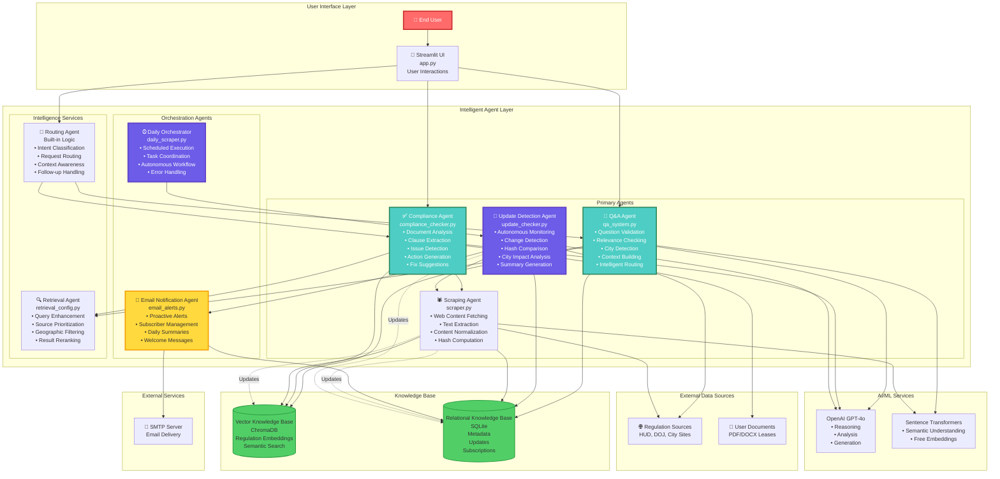
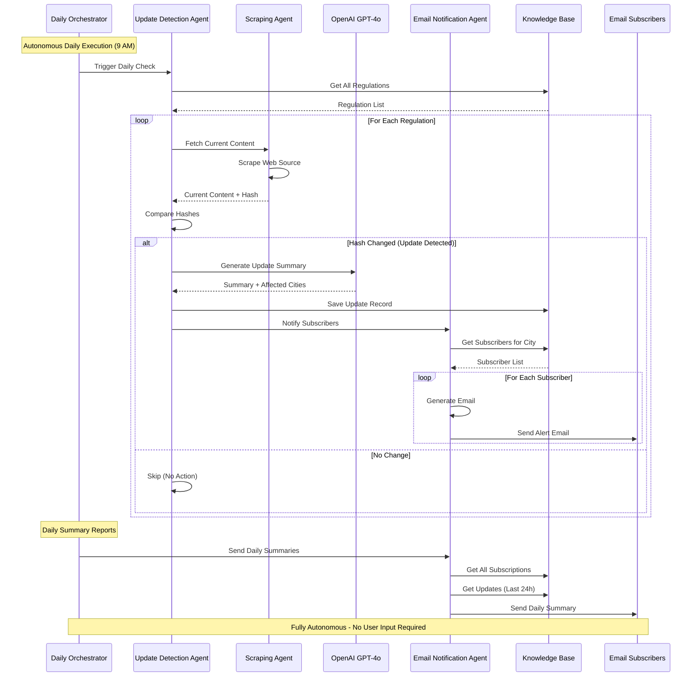
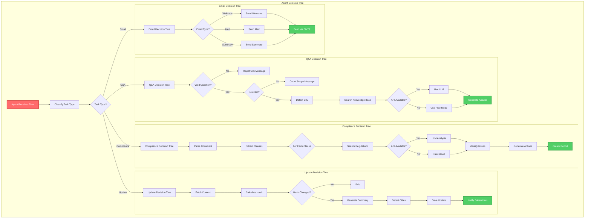
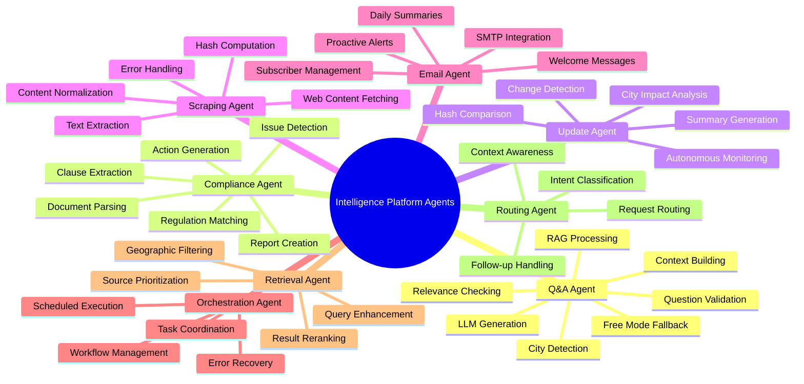
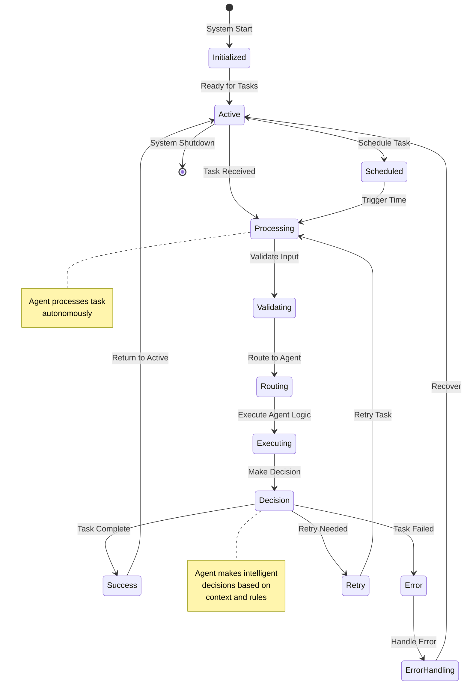
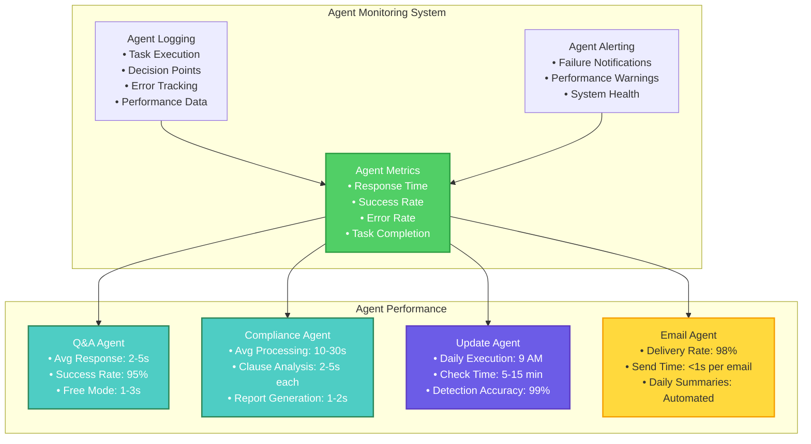
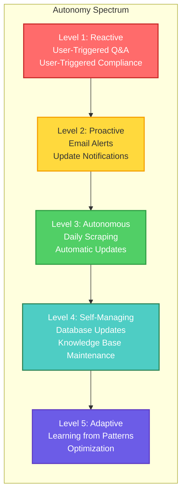

# Agent Solution Architecture Diagram - Intelligence Platform

Complete agentic architecture showing autonomous AI agents, intelligent routing, and proactive behaviors.

---

## 🤖 Agent Solution Architecture Overview

---

## 🔄 Autonomous Agent Workflows

---

## 🧠 Intelligent Q&A Agent Architecture

```mermaid
graph TB
    subgraph "Q&A Agent Intelligence Pipeline"
        INPUT[User Question] --> VALIDATE[Validation Agent<br/>• Question Quality Check<br/>• Gibberish Detection<br/>• Greeting Recognition]
        
        VALIDATE --> RELEVANCE[Relevance Agent<br/>• Domain Check<br/>• Scope Validation<br/>• Topic Classification]
        
        RELEVANCE --> ROUTING[Routing Agent<br/>• Intent Classification<br/>• Follow-up Detection<br/>• Context Awareness]
        
        ROUTING --> CITY[City Detection Agent<br/>• Geographic Extraction<br/>• City Mention Detection<br/>• Default Assignment]
        
        CITY --> ENHANCE[Query Enhancement Agent<br/>• Legal Terminology Expansion<br/>• Synonym Mapping<br/>• Context Enrichment]
        
        ENHANCE --> RETRIEVE[Retrieval Agent<br/>• Vector Search<br/>• Geographic Filtering<br/>• Source Prioritization<br/>• Result Reranking]
        
        RETRIEVE --> CONTEXT[Context Builder Agent<br/>• Regulation Aggregation<br/>• Update Integration<br/>• Chat History Inclusion<br/>• Context Optimization]
        
        CONTEXT --> DECISION{API Available?}
        
        DECISION -->|Yes| LLM_AGENT[LLM Generation Agent<br/>• GPT-4o Reasoning<br/>• Detailed Analysis<br/>• Source Citation]
        DECISION -->|No| FREE_AGENT[Free Mode Agent<br/>• Context Extraction<br/>• Keyword Matching<br/>• Pattern Recognition]
        
        LLM_AGENT --> RESPONSE[Response Agent<br/>• Answer Formatting<br/>• Source Linking<br/>• Confidence Scoring]
        FREE_AGENT --> RESPONSE
        
        RESPONSE --> OUTPUT[Formatted Answer + Sources]
    end

    style INPUT fill:#ff6b6b,stroke:#c92a2a,stroke-width:2px,color:#fff
    style OUTPUT fill:#51cf66,stroke:#2f9e44,stroke-width:2px,color:#fff
    style LLM_AGENT fill:#6c5ce7,stroke:#5f3dc4,stroke-width:2px,color:#fff
    style FREE_AGENT fill:#6c5ce7,stroke:#5f3dc4,stroke-width:2px,color:#fff
```

---

## ✅ Compliance Agent Architecture

```mermaid
graph TB
    subgraph "Compliance Agent Intelligence"
        DOC_INPUT[Document Upload] --> PARSE_AGENT[Parsing Agent<br/>• PDF Extraction<br/>• DOCX Processing<br/>• Text Normalization]
        
        PARSE_AGENT --> CLAUSE_AGENT[Clause Extraction Agent<br/>• Document Segmentation<br/>• Clause Identification<br/>• Structure Analysis]
        
        CLAUSE_AGENT --> LOOP{For Each Clause}
        
        LOOP --> SEARCH_AGENT[Search Agent<br/>• Vector Search<br/>• Regulation Matching<br/>• Relevance Scoring]
        
        SEARCH_AGENT --> ANALYSIS_AGENT{Analysis Mode}
        
        ANALYSIS_AGENT -->|API Available| LLM_ANALYZER[LLM Analyzer Agent<br/>• GPT-4o Analysis<br/>• Compliance Checking<br/>• Violation Detection<br/>• Issue Identification]
        
        ANALYSIS_AGENT -->|Free Mode| RULE_ANALYZER[Rule-based Analyzer Agent<br/>• Pattern Matching<br/>• Keyword Detection<br/>• Rule Application]
        
        LLM_ANALYZER --> ISSUE_AGENT[Issue Detection Agent<br/>• Violation Classification<br/>• Severity Assessment<br/>• Impact Analysis]
        RULE_ANALYZER --> ISSUE_AGENT
        
        ISSUE_AGENT --> ACTION_AGENT[Action Generation Agent<br/>• Fix Suggestions<br/>• Specific Recommendations<br/>• Compliance Steps]
        
        ACTION_AGENT --> REPORT_AGENT[Report Generation Agent<br/>• Report Formatting<br/>• Summary Creation<br/>• Action Items List]
        
        REPORT_AGENT --> COMP_OUTPUT[Compliance Report]
        
        LOOP -->|Next Clause| SEARCH_AGENT
    end

    style DOC_INPUT fill:#ff6b6b,stroke:#c92a2a,stroke-width:2px,color:#fff
    style COMP_OUTPUT fill:#51cf66,stroke:#2f9e44,stroke-width:2px,color:#fff
    style LLM_ANALYZER fill:#6c5ce7,stroke:#5f3dc4,stroke-width:2px,color:#fff
    style RULE_ANALYZER fill:#6c5ce7,stroke:#5f3dc4,stroke-width:2px,color:#fff
```

---

## 🔄 Agent Communication & Coordination

```mermaid
graph LR
    subgraph "Agent Communication Patterns"
        subgraph "Request-Response Agents"
            USER_REQ[User Request] --> ROUTER[Routing Agent]
            ROUTER --> QA[Q&A Agent]
            ROUTER --> COMP[Compliance Agent]
            QA --> RESPONSE[Response]
            COMP --> RESPONSE
        end

        subgraph "Event-Driven Agents"
            SCHEDULE[Scheduled Event] --> ORCHESTRATOR[Daily Orchestrator]
            ORCHESTRATOR --> UPDATE[Update Agent]
            UPDATE --> EMAIL[Email Agent]
            EMAIL --> NOTIFICATION[Email Notification]
        end

        subgraph "Pipeline Agents"
            INPUT_DATA[Input Data] --> AGENT1[Agent 1]
            AGENT1 --> AGENT2[Agent 2]
            AGENT2 --> AGENT3[Agent 3]
            AGENT3 --> OUTPUT_DATA[Output Data]
        end

        subgraph "Collaborative Agents"
            AGENT_A[Agent A] <--> SHARED_KB[Shared Knowledge Base]
            AGENT_B[Agent B] <--> SHARED_KB
            AGENT_C[Agent C] <--> SHARED_KB
        end
    end

    style USER_REQ fill:#ff6b6b,stroke:#c92a2a,stroke-width:2px,color:#fff
    style RESPONSE fill:#51cf66,stroke:#2f9e44,stroke-width:2px,color:#fff
    style SCHEDULE fill:#6c5ce7,stroke:#5f3dc4,stroke-width:2px,color:#fff
    style NOTIFICATION fill:#ffd93d,stroke:#f59f00,stroke-width:2px
```

---

## 🎯 Agent Decision-Making Framework

---

## 🤖 Agent Capabilities Matrix

---

## 🔄 Agent Lifecycle & State Management

---

## 📊 Agent Performance & Monitoring

---

## 🎯 Agent Autonomy Levels

---

## 📝 Agent Architecture Notes

### **Agent Characteristics**

1. **Autonomous Agents**
   - Daily Orchestrator: Runs without user input
   - Update Detection Agent: Monitors changes autonomously
   - Email Notification Agent: Sends proactive alerts

2. **Intelligent Agents**
   - Q&A Agent: Makes routing and context decisions
   - Compliance Agent: Analyzes and generates recommendations
   - Retrieval Agent: Enhances queries and prioritizes results

3. **Collaborative Agents**
   - Agents share knowledge base
   - Agents coordinate through orchestrator
   - Agents communicate via events

4. **Adaptive Agents**
   - Free mode fallback when API unavailable
   - Context-aware decision making
   - Error recovery and retry logic

### **Agent Communication Patterns**

- **Request-Response**: User-triggered agents (Q&A, Compliance)
- **Event-Driven**: Scheduled agents (Daily Orchestrator, Update Agent)
- **Pipeline**: Sequential processing (Document → Parse → Analyze)
- **Collaborative**: Shared knowledge base access

### **Agent Decision-Making**

- **Rule-Based**: Validation, routing, filtering
- **ML-Based**: Vector search, similarity matching
- **LLM-Based**: Analysis, generation, summarization
- **Hybrid**: Combination of all approaches

### **Current Autonomy Level**

**Level 3: Autonomous**
- ✅ Daily scraping without user input
- ✅ Automatic update detection
- ✅ Proactive email notifications
- ✅ Self-managing database updates
- ⚠️ Limited learning/adaptation (future enhancement)

---

**Last Updated**: November 2024  
**Based on**: Actual agentic codebase implementation  
**Autonomy Level**: Level 3 (Autonomous)

