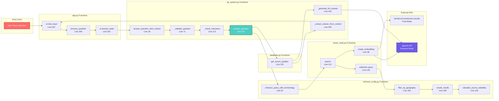
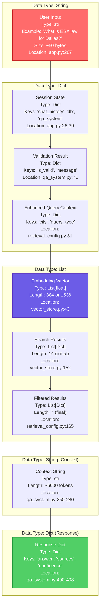
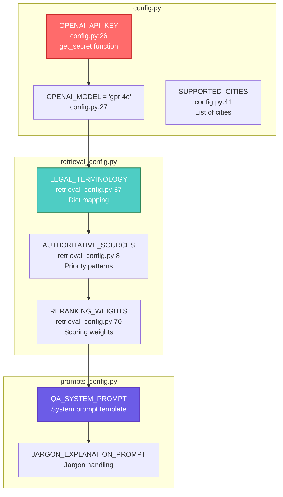
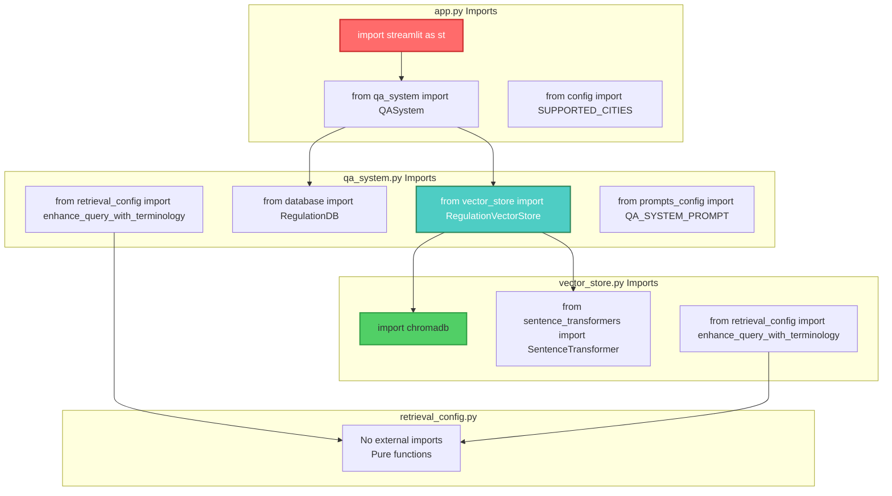
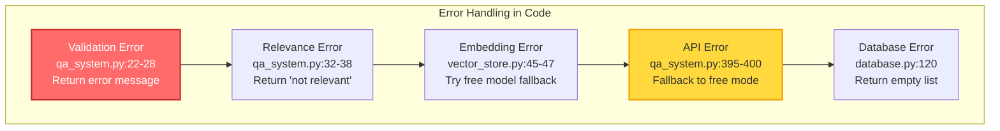

# Code-Based Data Flow Diagram - Intelligence Platform

Complete data flow diagram based on actual code implementation, showing exact function calls, file names, and code structure.

---

## 🔄 Code-Based End-to-End Data Flow

```mermaid
sequenceDiagram
    participant User as 👤 User
    participant App as app.py
    participant ProcessQ as process_question()<br/>app.py:200
    participant QASystem as QASystem<br/>qa_system.py:13
    participant Validate as _validate_question()<br/>qa_system.py:71
    participant Relevance as _check_relevance()<br/>qa_system.py:113
    participant CityDetect as _detect_city()<br/>qa_system.py:180
    participant AnswerQ as answer_question()<br/>qa_system.py:151
    participant VectorStore as RegulationVectorStore<br/>vector_store.py:17
    participant EnhanceQuery as enhance_query_with_terminology()<br/>retrieval_config.py:81
    participant CreateEmbed as create_embedding()<br/>vector_store.py:38
    participant SentenceTrans as SentenceTransformer<br/>all-MiniLM-L6-v2
    participant ChromaDB as ChromaDB Collection<br/>vector_store.py:146
    participant FilterGeo as filter_by_geography()<br/>retrieval_config.py:150
    participant Rerank as rerank_results()<br/>retrieval_config.py:180
    participant SourceRel as calculate_source_reliability()<br/>retrieval_config.py:120
    participant Database as RegulationDB<br/>database.py:11
    participant GetUpdates as get_recent_updates()<br/>database.py:120
    participant BuildContext as Build Context String<br/>qa_system.py:250
    participant LLMGen as _generate_llm_answer()<br/>qa_system.py:410
    participant OpenAI as OpenAI API<br/>GPT-4o
    participant FreeMode as _extract_answer_from_context()<br/>qa_system.py:454
    participant FormatResp as Format Response<br/>qa_system.py:400

    Note over User,FormatResp: USER INPUT PHASE
    User->>App: Types in st.chat_input()<br/>app.py:267
    App->>App: st.session_state.chat_history.append()<br/>app.py:202
    
    Note over App,ProcessQ: FRONTEND ROUTING
    App->>ProcessQ: process_question(prompt_text)<br/>app.py:200
    ProcessQ->>ProcessQ: st.session_state.chat_history.append()<br/>app.py:202
    ProcessQ->>QASystem: answer_question_with_context()<br/>app.py:203
    
    Note over QASystem,Validate: VALIDATION PHASE
    QASystem->>Validate: _validate_question(question)<br/>qa_system.py:21
    Validate->>Validate: Check length, gibberish<br/>qa_system.py:84-100
    Validate-->>QASystem: {is_valid: bool, message: str}
    
    alt Invalid Question
        QASystem-->>ProcessQ: Return error message
        ProcessQ-->>App: Display error
    end
    
    QASystem->>Relevance: _check_relevance(question)<br/>qa_system.py:31
    Relevance->>Relevance: Check domain keywords<br/>qa_system.py:113-140
    Relevance-->>QASystem: {is_relevant: bool, message: str}
    
    alt Not Relevant
        QASystem-->>ProcessQ: Return "not relevant"
    end
    
    Note over QASystem,CityDetect: CITY DETECTION
    QASystem->>CityDetect: Extract city from question<br/>qa_system.py:180-194
    CityDetect->>CityDetect: Check city_keywords dict<br/>qa_system.py:183-188
    CityDetect-->>QASystem: detected_city = "Dallas"
    
    Note over QASystem,AnswerQ: MAIN Q&A PROCESSING
    QASystem->>AnswerQ: answer_question(question, city)<br/>qa_system.py:151
    
    Note over AnswerQ,EnhanceQuery: QUERY ENHANCEMENT
    AnswerQ->>EnhanceQuery: enhance_query_with_terminology()<br/>qa_system.py:241 (via vector_store.search)
    
    EnhanceQuery->>EnhanceQuery: Check LEGAL_TERMINOLOGY dict<br/>retrieval_config.py:37-50
    EnhanceQuery->>EnhanceQuery: Expand "ESA" → multiple terms<br/>retrieval_config.py:98-100
    EnhanceQuery->>EnhanceQuery: Add synonyms from dict<br/>retrieval_config.py:101-105
    EnhanceQuery->>EnhanceQuery: Add geographic context<br/>retrieval_config.py:106-110
    EnhanceQuery-->>AnswerQ: Enhanced query string
    
    Note over AnswerQ,VectorStore: VECTOR SEARCH INITIATION
    AnswerQ->>VectorStore: search(query, n_results=7,<br/>context={city}, filter_geography)<br/>qa_system.py:241-246
    
    Note over VectorStore,CreateEmbed: EMBEDDING GENERATION
    VectorStore->>EnhanceQuery: enhance_query_with_terminology()<br/>vector_store.py:130
    EnhanceQuery-->>VectorStore: Final enhanced query
    VectorStore->>CreateEmbed: create_embedding(enhanced_query)<br/>vector_store.py:133
    
    CreateEmbed->>CreateEmbed: Check use_free_embeddings flag<br/>vector_store.py:40
    
    alt Free Mode (No API Key)
        CreateEmbed->>SentenceTrans: SentenceTransformer('all-MiniLM-L6-v2')<br/>vector_store.py:32
        SentenceTrans->>SentenceTrans: model.encode(text)<br/>vector_store.py:43
        SentenceTrans-->>CreateEmbed: numpy array (384 dims)
        CreateEmbed->>CreateEmbed: .tolist() conversion<br/>vector_store.py:43
        CreateEmbed-->>VectorStore: embedding list
    else Premium Mode (API Key)
        CreateEmbed->>CreateEmbed: OpenAI(api_key=OPENAI_API_KEY)<br/>vector_store.py:61
        CreateEmbed->>OpenAI: client.embeddings.create()<br/>vector_store.py:62-65
        OpenAI-->>CreateEmbed: response.data[0].embedding
        CreateEmbed-->>VectorStore: embedding list (1536 dims)
    end
    
    Note over VectorStore,ChromaDB: VECTOR DATABASE SEARCH
    VectorStore->>VectorStore: initial_n = n_results * 2<br/>vector_store.py:138
    VectorStore->>ChromaDB: collection.query()<br/>vector_store.py:146-150
    Note over ChromaDB: query_embeddings=[query_embedding]<br/>n_results=14 (2x for reranking)<br/>where clause (if category_filter)
    ChromaDB->>ChromaDB: HNSW Index Search<br/>Cosine Similarity
    ChromaDB-->>VectorStore: results dict<br/>{ids, documents, metadatas, distances}
    
    Note over VectorStore,FilterGeo: RESULT FORMATTING
    VectorStore->>VectorStore: Format results<br/>vector_store.py:152-161
    VectorStore-->>VectorStore: formatted_results list
    
    Note over VectorStore,Rerank: FILTERING & RERANKING
    VectorStore->>FilterGeo: filter_by_geography()<br/>vector_store.py:164
    FilterGeo->>FilterGeo: Check metadata['city']<br/>retrieval_config.py:150-165
    FilterGeo->>FilterGeo: Check URL patterns<br/>retrieval_config.py:156-160
    FilterGeo-->>VectorStore: Filtered results
    
    VectorStore->>Rerank: rerank_results()<br/>vector_store.py:168
    Rerank->>SourceRel: calculate_source_reliability()<br/>retrieval_config.py:180
    SourceRel->>SourceRel: Check AUTHORITATIVE_SOURCES<br/>retrieval_config.py:8-34
    SourceRel->>SourceRel: Match URL patterns<br/>retrieval_config.py:125-135
    SourceRel-->>Rerank: Reliability scores
    
    Rerank->>Rerank: Apply RERANKING_WEIGHTS<br/>retrieval_config.py:180-220
    Rerank->>Rerank: Calculate final scores<br/>retrieval_config.py:200-210
    Rerank->>Rerank: Sort by score<br/>retrieval_config.py:215
    Rerank-->>VectorStore: Reranked results
    
    VectorStore->>VectorStore: Return top n_results<br/>vector_store.py:172
    VectorStore-->>AnswerQ: Top 7 regulation chunks
    
    Note over AnswerQ,GetUpdates: CONTEXT BUILDING
    AnswerQ->>Database: get_recent_updates(city, limit=3)<br/>qa_system.py:250
    Database->>GetUpdates: SQL Query<br/>database.py:120-140
    GetUpdates->>GetUpdates: SELECT * FROM updates<br/>WHERE city LIKE '%Dallas%'<br/>ORDER BY detected_at DESC<br/>LIMIT 3
    GetUpdates-->>Database: Updates list
    Database-->>AnswerQ: Recent updates
    
    AnswerQ->>BuildContext: Build context string<br/>qa_system.py:250-280
    BuildContext->>BuildContext: Format regulations<br/>qa_system.py:255-265
    BuildContext->>BuildContext: Add recent updates<br/>qa_system.py:270-275
    BuildContext->>BuildContext: Include chat history<br/>qa_system.py:49-68
    BuildContext-->>AnswerQ: Full context (~6000 tokens)
    
    Note over AnswerQ,LLMGen: LLM PROCESSING DECISION
    AnswerQ->>AnswerQ: Check OPENAI_API_KEY<br/>qa_system.py:382-401
    
    alt OpenAI API Available
        AnswerQ->>LLMGen: _generate_llm_answer()<br/>qa_system.py:395
        LLMGen->>LLMGen: Build prompt string<br/>qa_system.py:416-437
        LLMGen->>LLMGen: Import OpenAI client<br/>qa_system.py:413
        LLMGen->>OpenAI: client.chat.completions.create()<br/>qa_system.py:439
        Note over OpenAI: model="gpt-4o"<br/>temperature=0<br/>messages=[system, user]
        OpenAI->>OpenAI: GPT-4o Processing<br/>Token counting, reasoning
        OpenAI-->>LLMGen: response.choices[0].message.content
        LLMGen-->>AnswerQ: Generated answer
    else Free Mode
        AnswerQ->>FreeMode: _extract_answer_from_context()<br/>qa_system.py:401
        FreeMode->>FreeMode: Keyword matching<br/>qa_system.py:460-480
        FreeMode->>FreeMode: Pattern recognition<br/>qa_system.py:485-500
        FreeMode->>FreeMode: Extract relevant sentences<br/>qa_system.py:505-520
        FreeMode-->>AnswerQ: Extracted answer
    end
    
    Note over AnswerQ,FormatResp: RESPONSE FORMATTING
    AnswerQ->>FormatResp: Format response dict<br/>qa_system.py:400-408
    FormatResp->>FormatResp: Build sources list<br/>qa_system.py:290-300
    FormatResp->>FormatResp: Add confidence score<br/>qa_system.py:305
    FormatResp-->>AnswerQ: {answer, sources, confidence}
    
    AnswerQ-->>QASystem: Response dict
    QASystem-->>ProcessQ: Return response
    
    Note over ProcessQ,App: FRONTEND DISPLAY
    ProcessQ->>ProcessQ: st.session_state.chat_history.append()<br/>app.py:204-208
    ProcessQ->>App: st.rerun()<br/>app.py:209
    App->>App: Display chat history<br/>app.py:223-265
    App->>App: st.chat_message("assistant")<br/>app.py:230
    App->>App: st.markdown(answer_content)<br/>app.py:245
    App->>App: st.expander("Sources")<br/>app.py:312
    App-->>User: Display answer + sources
```



---

## 📁 File-Based Data Flow Architecture

```mermaid
graph TB
    subgraph "1. User Input - app.py"
        UI_INPUT[st.chat_input()<br/>app.py:267<br/>User types question]
        SESSION_APP[st.session_state<br/>app.py:26-39<br/>Session management]
        PROCESS_FUNC[process_question()<br/>app.py:200<br/>Helper function]
    end

    subgraph "2. Q&A System - qa_system.py"
        QA_INIT[QASystem.__init__()<br/>qa_system.py:14-16<br/>Initialize components]
        QA_CONTEXT[answer_question_with_context()<br/>qa_system.py:18<br/>Main entry point]
        QA_VALID[_validate_question()<br/>qa_system.py:71<br/>Validation logic]
        QA_RELEV[_check_relevance()<br/>qa_system.py:113<br/>Relevance check]
        QA_ANSWER[answer_question()<br/>qa_system.py:151<br/>Core Q&A logic]
        QA_LLM[_generate_llm_answer()<br/>qa_system.py:410<br/>LLM generation]
        QA_FREE[_extract_answer_from_context()<br/>qa_system.py:454<br/>Free mode]
    end

    subgraph "3. Retrieval Config - retrieval_config.py"
        ENHANCE_FUNC[enhance_query_with_terminology()<br/>retrieval_config.py:81<br/>Query expansion]
        LEGAL_TERM[LEGAL_TERMINOLOGY dict<br/>retrieval_config.py:37-50<br/>Term mapping]
        GEO_FILTER[filter_by_geography()<br/>retrieval_config.py:150<br/>City filtering]
        RERANK_FUNC[rerank_results()<br/>retrieval_config.py:180<br/>Result ranking]
        SOURCE_REL[calculate_source_reliability()<br/>retrieval_config.py:120<br/>Source scoring]
        AUTH_SOURCES[AUTHORITATIVE_SOURCES<br/>retrieval_config.py:8-34<br/>Priority patterns]
    end

    subgraph "4. Vector Store - vector_store.py"
        VS_INIT[RegulationVectorStore.__init__()<br/>vector_store.py:18-36<br/>Initialize ChromaDB]
        VS_EMBED[create_embedding()<br/>vector_store.py:38<br/>Embedding creation]
        VS_SEARCH[search()<br/>vector_store.py:113<br/>Vector search]
        VS_CHUNK[add_regulation_chunks()<br/>vector_store.py:80<br/>Store chunks]
    end

    subgraph "5. Embedding Services"
        SENT_TRANS[SentenceTransformer<br/>all-MiniLM-L6-v2<br/>vector_store.py:32<br/>Free embeddings]
        OPENAI_EMBED[OpenAI Embeddings API<br/>text-embedding-3-small<br/>vector_store.py:62<br/>Premium embeddings]
    end

    subgraph "6. Vector Database - ChromaDB"
        CHROMA_COLL[Collection: regulations<br/>vector_store.py:20-23<br/>ChromaDB collection]
        CHROMA_QUERY[collection.query()<br/>vector_store.py:146<br/>HNSW search]
        CHROMA_ADD[collection.add()<br/>vector_store.py:106<br/>Store embeddings]
    end

    subgraph "7. Database - database.py"
        DB_INIT[RegulationDB.__init__()<br/>database.py:12-14<br/>SQLite connection]
        DB_UPDATES[get_recent_updates()<br/>database.py:120<br/>Query updates]
        DB_REG[get_all_regulations()<br/>database.py:60<br/>Get regulations]
    end

    subgraph "8. LLM Service - OpenAI"
        OPENAI_CLIENT[OpenAI Client<br/>qa_system.py:414<br/>API client]
        GPT4_MODEL[GPT-4o Model<br/>config.py:27<br/>Model name]
        CHAT_COMPLETE[chat.completions.create()<br/>qa_system.py:439<br/>API call]
    end

    subgraph "9. Response Formatting - app.py"
        CHAT_DISPLAY[st.chat_message()<br/>app.py:230<br/>Display answer]
        SOURCE_EXPANDER[st.expander()<br/>app.py:312<br/>Show sources]
        HISTORY_UPDATE[Update chat_history<br/>app.py:204<br/>Store response]
    end

    %% Flow Connections
    UI_INPUT --> SESSION_APP
    SESSION_APP --> PROCESS_FUNC
    PROCESS_FUNC --> QA_CONTEXT
    
    QA_CONTEXT --> QA_VALID
    QA_VALID --> QA_RELEV
    QA_RELEV --> QA_ANSWER
    
    QA_ANSWER --> ENHANCE_FUNC
    ENHANCE_FUNC --> LEGAL_TERM
    ENHANCE_FUNC --> VS_SEARCH
    
    VS_SEARCH --> VS_EMBED
    VS_EMBED --> SENT_TRANS
    VS_EMBED --> OPENAI_EMBED
    SENT_TRANS --> CHROMA_QUERY
    OPENAI_EMBED --> CHROMA_QUERY
    
    CHROMA_QUERY --> GEO_FILTER
    GEO_FILTER --> RERANK_FUNC
    RERANK_FUNC --> SOURCE_REL
    SOURCE_REL --> AUTH_SOURCES
    
    QA_ANSWER --> DB_UPDATES
    DB_UPDATES --> QA_LLM
    QA_LLM --> OPENAI_CLIENT
    OPENAI_CLIENT --> CHAT_COMPLETE
    CHAT_COMPLETE --> GPT4_MODEL
    
    QA_ANSWER --> QA_FREE
    QA_FREE --> CHAT_DISPLAY
    QA_LLM --> CHAT_DISPLAY
    CHAT_DISPLAY --> SOURCE_EXPANDER
    SOURCE_EXPANDER --> HISTORY_UPDATE

    style UI_INPUT fill:#ff6b6b,stroke:#c92a2a,stroke-width:2px,color:#fff
    style QA_ANSWER fill:#4ecdc4,stroke:#2d8659,stroke-width:2px,color:#fff
    style CHROMA_QUERY fill:#51cf66,stroke:#2f9e44,stroke-width:2px
    style GPT4_MODEL fill:#6c5ce7,stroke:#5f3dc4,stroke-width:2px,color:#fff
    style CHAT_DISPLAY fill:#ffd93d,stroke:#f59f00,stroke-width:2px
```

---

## 🔍 Function Call Flow (Code Execution Path)



---

## 📊 Data Structure Flow



---

## 🔧 Configuration & Constants Flow



---

## 📝 Code Execution Timeline

```mermaid
gantt
    title Code Execution Timeline (Based on Actual Code)
    dateFormat X
    axisFormat %Lms
    
    section app.py
    st.chat_input() capture          :0, 10ms
    process_question() call           :10ms, 5ms
    Session state update              :15ms, 5ms
    
    section qa_system.py
    answer_question_with_context()    :20ms, 10ms
    _validate_question()              :30ms, 20ms
    _check_relevance()                :50ms, 20ms
    answer_question()                 :70ms, 10ms
    
    section retrieval_config.py
    enhance_query_with_terminology()  :80ms, 50ms
    
    section vector_store.py
    search() call                     :130ms, 10ms
    create_embedding()                :140ms, 500ms
    collection.query()                :640ms, 200ms
    
    section retrieval_config.py
    filter_by_geography()            :840ms, 30ms
    rerank_results()                  :870ms, 50ms
    
    section database.py
    get_recent_updates()              :920ms, 100ms
    
    section qa_system.py
    Build context string              :1020ms, 80ms
    _generate_llm_answer() or         :1100ms, 3000ms
    _extract_answer_from_context()    :1100ms, 500ms
    
    section app.py
    Format response                   :4100ms, 50ms
    st.chat_message() display         :4150ms, 100ms
    st.rerun()                        :4250ms, 50ms
```

---

## 🗂️ Module Import & Dependency Flow



---

## 📋 Key Code Locations Reference

| Component | File | Function/Class | Line Range |
|-----------|------|---------------|------------|
| **User Input** | `app.py` | `st.chat_input()` | 267 |
| **Question Processing** | `app.py` | `process_question()` | 200-209 |
| **Q&A Entry Point** | `qa_system.py` | `answer_question_with_context()` | 18-69 |
| **Validation** | `qa_system.py` | `_validate_question()` | 71-111 |
| **Relevance Check** | `qa_system.py` | `_check_relevance()` | 113-149 |
| **City Detection** | `qa_system.py` | `answer_question()` | 180-194 |
| **Query Enhancement** | `retrieval_config.py` | `enhance_query_with_terminology()` | 81-115 |
| **Vector Search** | `vector_store.py` | `search()` | 113-172 |
| **Embedding Creation** | `vector_store.py` | `create_embedding()` | 38-78 |
| **Geographic Filter** | `retrieval_config.py` | `filter_by_geography()` | 150-175 |
| **Result Reranking** | `retrieval_config.py` | `rerank_results()` | 180-225 |
| **Source Reliability** | `retrieval_config.py` | `calculate_source_reliability()` | 120-148 |
| **Database Query** | `database.py` | `get_recent_updates()` | 120-140 |
| **LLM Generation** | `qa_system.py` | `_generate_llm_answer()` | 410-452 |
| **Free Mode** | `qa_system.py` | `_extract_answer_from_context()` | 454-528 |
| **Response Display** | `app.py` | `st.chat_message()` | 230-265 |

---

## 🔄 Error Handling Flow



---

**Last Updated**: November 2024  
**Based on**: Actual codebase file structure and line numbers  
**Code Version**: Current implementation


