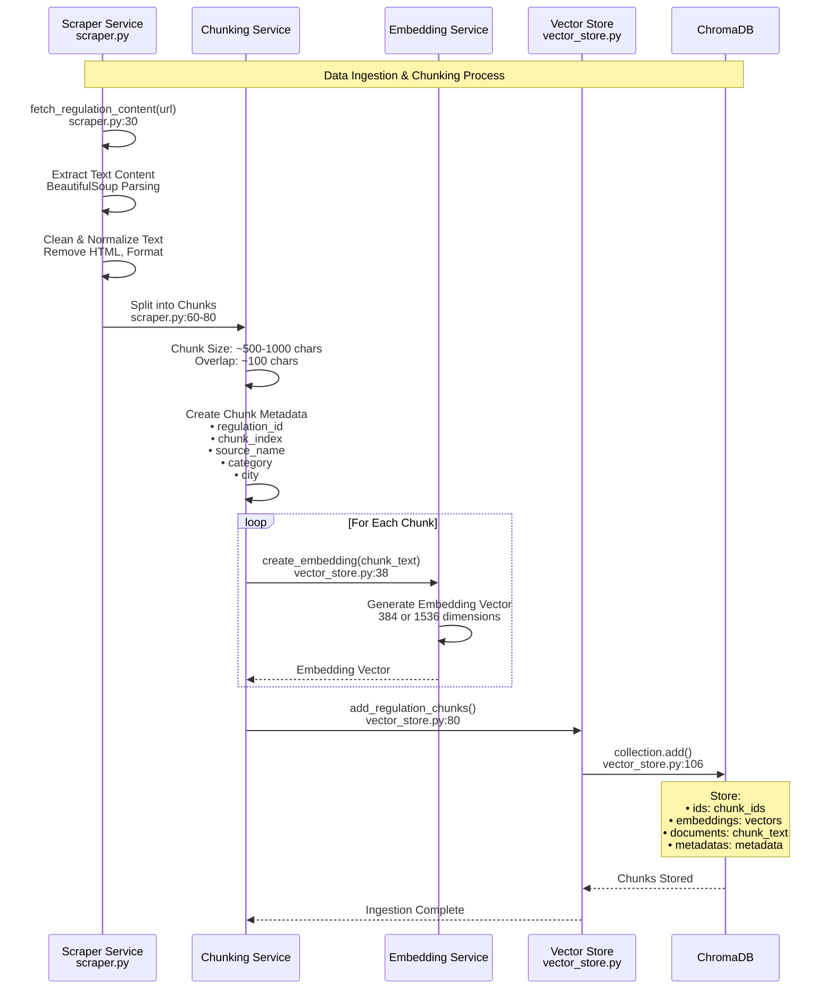
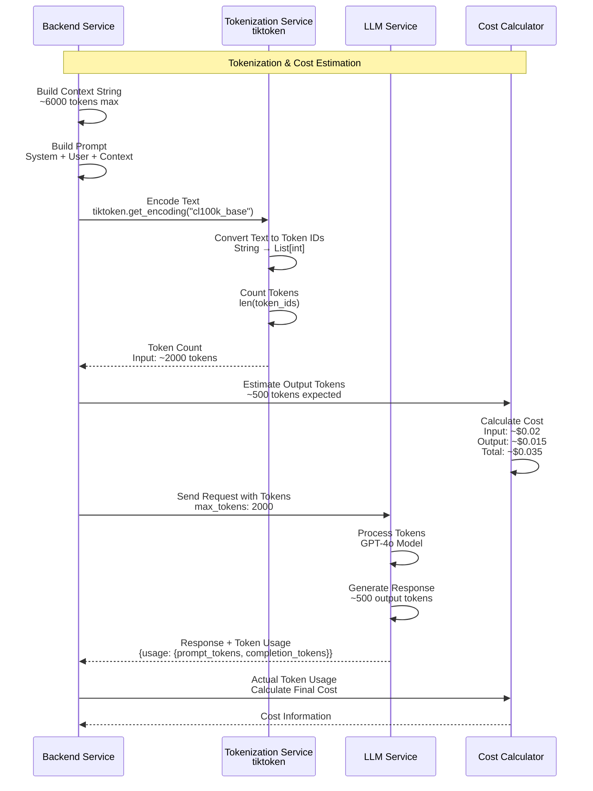
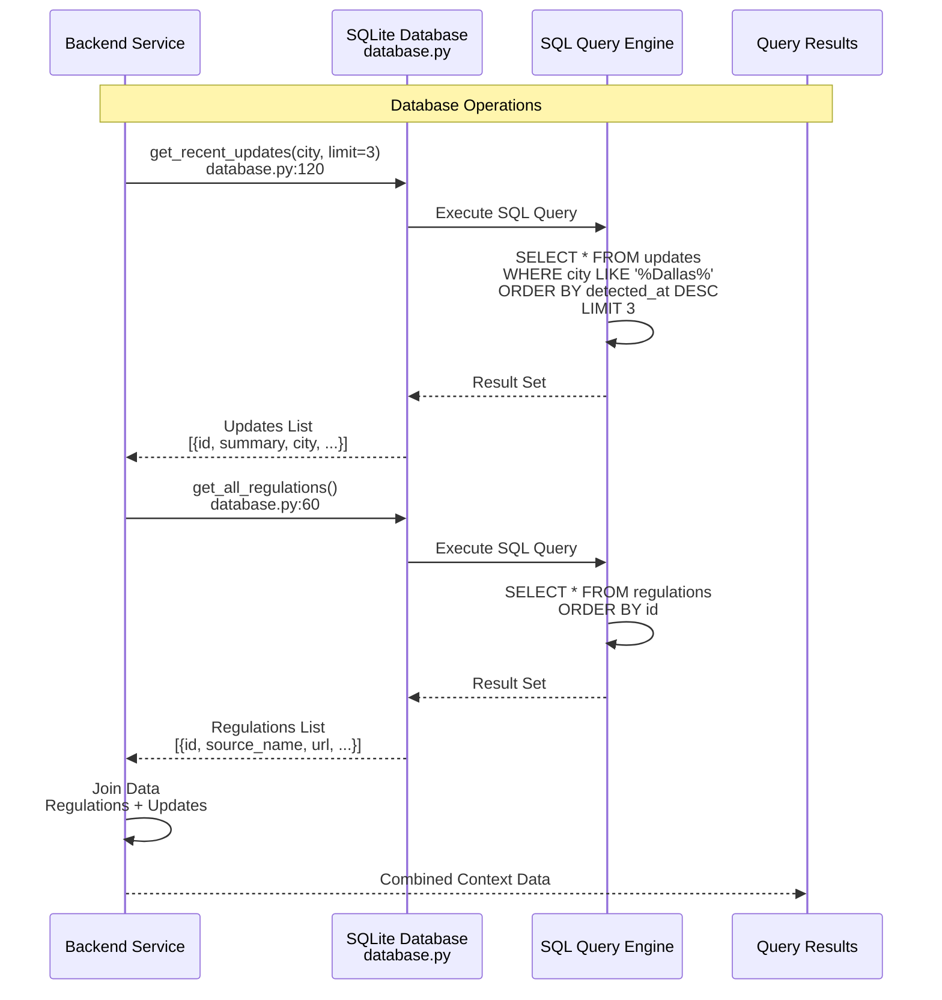
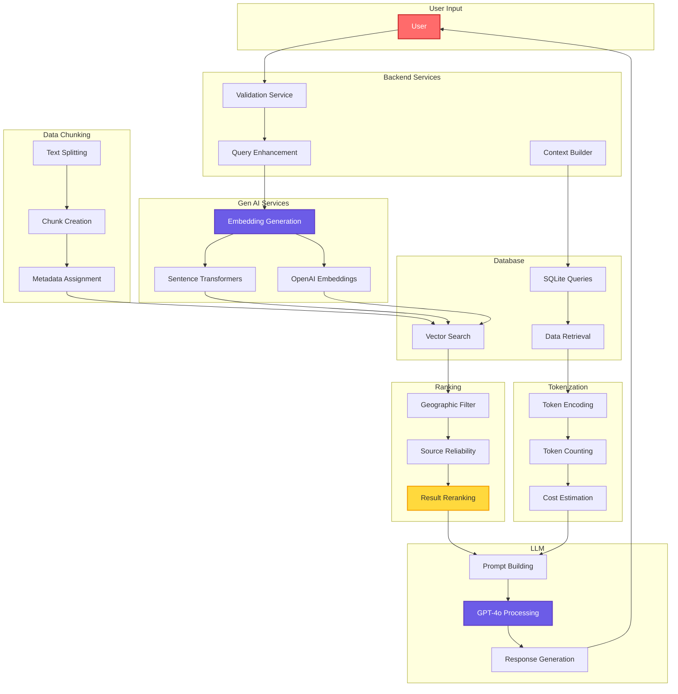

# Comprehensive End-to-End Data Flow Diagram

Complete data flow from user input through all system components: Backend Services, Gen AI Services, LLM, Data Chunking, Tokenization, Database, and Ranking.

---

## 🔄 Complete End-to-End Data Flow

```mermaid
sequenceDiagram
    participant User as 👤 User
    participant Browser as 🌐 Web Browser
    participant Frontend as 📱 Frontend (Streamlit)<br/>app.py
    participant Backend as ⚙️ Backend Services<br/>qa_system.py
    participant Validation as ✅ Validation Service
    participant QueryEnhance as 🔍 Query Enhancement<br/>retrieval_config.py
    participant VectorStore as 💾 Vector Store Service<br/>vector_store.py
    participant Chunking as 📄 Data Chunking Service<br/>scraper.py
    participant Embedding as 🤖 Embedding Service<br/>Gen AI
    participant Tokenization as 🔢 Tokenization Service<br/>tiktoken
    participant ChromaDB as 🗄️ ChromaDB<br/>Vector Database
    participant Ranking as 📊 Ranking Service<br/>retrieval_config.py
    participant SQLite as 💾 SQLite Database<br/>database.py
    participant LLM as 🧠 LLM Service<br/>OpenAI GPT-4o
    participant Response as 📤 Response Service

    Note over User,Response: PHASE 1: USER INPUT
    User->>Browser: Types Question<br/>"What is ESA law for Dallas?"
    Browser->>Frontend: HTTP POST Request<br/>User Input Data
    Frontend->>Frontend: st.chat_input()<br/>Capture Input
    Frontend->>Frontend: Session State Management<br/>Store in chat_history

    Note over Frontend,Backend: PHASE 2: BACKEND SERVICES
    Frontend->>Backend: answer_question_with_context()<br/>qa_system.py:18
    Backend->>Validation: _validate_question()<br/>Check Quality
    Validation-->>Backend: Validation Result
    
    Backend->>Validation: _check_relevance()<br/>Domain Check
    Validation-->>Backend: Relevance Result
    
    Backend->>Backend: _detect_city()<br/>Extract City: "Dallas"
    Backend->>Backend: answer_question()<br/>qa_system.py:151

    Note over Backend,QueryEnhance: PHASE 3: QUERY ENHANCEMENT
    Backend->>QueryEnhance: enhance_query_with_terminology()<br/>retrieval_config.py:81
    QueryEnhance->>QueryEnhance: Expand Legal Terms<br/>ESA → Multiple Terms
    QueryEnhance->>QueryEnhance: Add Synonyms<br/>law → regulation, statute
    QueryEnhance->>QueryEnhance: Add Geographic Context<br/>Dallas, Texas
    QueryEnhance-->>Backend: Enhanced Query String

    Note over Backend,VectorStore: PHASE 4: VECTOR STORE SERVICE
    Backend->>VectorStore: search(query, n_results=7)<br/>vector_store.py:113
    VectorStore->>QueryEnhance: enhance_query_with_terminology()<br/>Double Enhancement
    QueryEnhance-->>VectorStore: Final Enhanced Query

    Note over VectorStore,Embedding: PHASE 5: EMBEDDING GENERATION (Gen AI)
    VectorStore->>Embedding: create_embedding(enhanced_query)<br/>vector_store.py:38
    
    alt Free Mode (Sentence Transformers)
        Embedding->>Embedding: SentenceTransformer('all-MiniLM-L6-v2')<br/>vector_store.py:32
        Embedding->>Embedding: model.encode(text)<br/>Gen AI Processing
        Embedding-->>VectorStore: Embedding Vector (384 dims)
    else Premium Mode (OpenAI)
        Embedding->>Embedding: OpenAI Embeddings API<br/>text-embedding-3-small
        Embedding->>Embedding: Gen AI Embedding Model
        Embedding-->>VectorStore: Embedding Vector (1536 dims)
    end

    Note over VectorStore,ChromaDB: PHASE 6: VECTOR DATABASE SEARCH
    VectorStore->>ChromaDB: collection.query()<br/>vector_store.py:146
    ChromaDB->>ChromaDB: HNSW Index Search<br/>Cosine Similarity
    ChromaDB->>ChromaDB: Retrieve Regulation Chunks<br/>Stored Embeddings
    ChromaDB-->>VectorStore: Initial Results (14 chunks)

    Note over VectorStore,Chunking: PHASE 7: DATA CHUNKING (Reference)
    Note over Chunking: Chunks Created During Ingestion<br/>scraper.py:60-80
    Chunking->>Chunking: Split Text into Chunks<br/>~500-1000 chars each
    Chunking->>Chunking: Create Chunk Metadata<br/>regulation_id, chunk_index
    Chunking->>Chunking: Store Chunks in ChromaDB<br/>With Embeddings

    Note over VectorStore,Ranking: PHASE 8: RANKING SERVICE
    VectorStore->>Ranking: filter_by_geography()<br/>retrieval_config.py:150
    Ranking->>Ranking: Filter by City Metadata<br/>Dallas-specific
    Ranking-->>VectorStore: Filtered Results
    
    VectorStore->>Ranking: rerank_results()<br/>retrieval_config.py:180
    Ranking->>Ranking: calculate_source_reliability()<br/>retrieval_config.py:120
    Ranking->>Ranking: Apply Reranking Weights<br/>Distance + Reliability
    Ranking->>Ranking: Sort by Final Score<br/>Best Results First
    Ranking-->>VectorStore: Top 7 Ranked Results

    Note over Backend,SQLite: PHASE 9: DATABASE QUERIES
    Backend->>SQLite: get_recent_updates(city, limit=3)<br/>database.py:120
    SQLite->>SQLite: SQL Query<br/>SELECT * FROM updates<br/>WHERE city LIKE '%Dallas%'<br/>ORDER BY detected_at DESC
    SQLite-->>Backend: Recent Updates List

    Backend->>SQLite: get_all_regulations()<br/>database.py:60
    SQLite->>SQLite: SQL Query<br/>SELECT * FROM regulations
    SQLite-->>Backend: Regulation Metadata

    Note over Backend,LLM: PHASE 10: CONTEXT BUILDING
    Backend->>Backend: Build Context String<br/>qa_system.py:250-280
    Backend->>Backend: Aggregate Regulations<br/>Top 7 Chunks
    Backend->>Backend: Add Recent Updates<br/>Last 3 Updates
    Backend->>Backend: Include Chat History<br/>Follow-up Context
    Backend-->>Backend: Full Context (~6000 tokens)

    Note over Backend,Tokenization: PHASE 11: TOKENIZATION
    Backend->>Tokenization: Count Tokens (if using LLM)<br/>tiktoken library
    Tokenization->>Tokenization: Encode Context String<br/>Token IDs
    Tokenization->>Tokenization: Calculate Token Count<br/>Input + Output Estimate
    Tokenization-->>Backend: Token Count (~2000 tokens)

    Note over Backend,LLM: PHASE 12: LLM PROCESSING
    Backend->>Backend: Check API Availability<br/>OPENAI_API_KEY exists?
    
    alt OpenAI API Available
        Backend->>LLM: _generate_llm_answer()<br/>qa_system.py:410
        Backend->>LLM: Build Prompt<br/>System + User + Context
        Backend->>LLM: client.chat.completions.create()<br/>qa_system.py:439
        
        Note over LLM: Model: gpt-4o<br/>Temperature: 0<br/>Max Tokens: 2000
        
        LLM->>LLM: Token Processing<br/>Input: ~2000 tokens
        LLM->>LLM: Reasoning & Generation<br/>GPT-4o Processing
        LLM->>LLM: Output Generation<br/>~500 tokens
        LLM-->>Backend: Generated Answer + Metadata
    else Free Mode
        Backend->>Backend: _extract_answer_from_context()<br/>qa_system.py:454
        Backend->>Backend: Keyword Matching<br/>Pattern Recognition
        Backend-->>Backend: Extracted Answer
    end

    Note over Backend,Response: PHASE 13: RESPONSE FORMATTING
    Backend->>Response: Format Response Dict<br/>qa_system.py:400-408
    Response->>Response: Add Source Links<br/>URL Formatting
    Response->>Response: Add Confidence Score<br/>Based on Sources
    Response-->>Backend: {answer, sources, confidence}

    Backend-->>Frontend: Return Response Dict
    Frontend->>Frontend: Update Chat History<br/>st.session_state
    Frontend->>Frontend: Display Answer<br/>st.chat_message()
    Frontend->>Frontend: Display Sources<br/>st.expander()
    Frontend-->>User: Final Answer + Sources
```



---

## 🏗️ Complete System Architecture with All Components

```mermaid
graph TB
    subgraph "1. User Layer"
        USER[👤 User<br/>Types Question]
        BROWSER[🌐 Web Browser<br/>HTTPS Request]
    end

    subgraph "2. Frontend Services"
        STREAMLIT[📱 Streamlit Frontend<br/>app.py<br/>• st.chat_input()<br/>• Session State<br/>• UI Rendering]
    end

    subgraph "3. Backend Services"
        QA_BACKEND[Q&A Backend Service<br/>qa_system.py<br/>• answer_question_with_context()<br/>• answer_question()<br/>• Context Building]
        VALIDATION_SVC[Validation Service<br/>qa_system.py<br/>• _validate_question()<br/>• _check_relevance()<br/>• _detect_city()]
        QUERY_SVC[Query Enhancement Service<br/>retrieval_config.py<br/>• enhance_query_with_terminology()<br/>• Legal Term Expansion<br/>• Synonym Mapping]
    end

    subgraph "4. Gen AI Services"
        EMBEDDING_SVC[Embedding Service<br/>vector_store.py<br/>• create_embedding()]
        SENTENCE_AI[Sentence Transformers<br/>all-MiniLM-L6-v2<br/>• Free Gen AI Model<br/>• 384 Dimensions<br/>• Local Processing]
        OPENAI_EMBED[OpenAI Embeddings<br/>text-embedding-3-small<br/>• Premium Gen AI<br/>• 1536 Dimensions<br/>• API-based]
    end

    subgraph "5. Data Chunking Service"
        CHUNKING_SVC[Chunking Service<br/>scraper.py<br/>• Split Text<br/>• Create Chunks<br/>• Add Metadata]
        CHUNK_PROC[Chunk Processing<br/>• ~500-1000 chars<br/>• Overlap Handling<br/>• Index Tracking]
    end

    subgraph "6. Tokenization Service"
        TOKEN_SVC[Tokenization Service<br/>tiktoken library<br/>• Token Encoding<br/>• Token Counting<br/>• Cost Estimation]
        TOKEN_ENCODE[Token Encoder<br/>• Text → Token IDs<br/>• GPT-4o Encoding<br/>• Token Limits]
    end

    subgraph "7. Vector Database"
        CHROMADB[(ChromaDB<br/>Vector Database<br/>• HNSW Index<br/>• Embedding Storage<br/>• Similarity Search)]
        CHUNK_STORAGE[Chunk Storage<br/>• Regulation Chunks<br/>• Embeddings<br/>• Metadata]
    end

    subgraph "8. Ranking Service"
        RANKING_SVC[Ranking Service<br/>retrieval_config.py<br/>• rerank_results()<br/>• Source Prioritization<br/>• Score Calculation]
        GEO_FILTER[Geographic Filter<br/>filter_by_geography()<br/>• City Filtering<br/>• URL Pattern Matching]
        RELIABILITY[Source Reliability<br/>calculate_source_reliability()<br/>• Authority Scoring<br/>• Pattern Matching]
    end

    subgraph "9. Relational Database"
        SQLITE[(SQLite Database<br/>database.py<br/>• Regulation Metadata<br/>• Update History<br/>• Subscriptions)]
        SQL_QUERIES[SQL Queries<br/>• SELECT operations<br/>• JOIN operations<br/>• Filtering]
    end

    subgraph "10. LLM Service"
        LLM_SVC[LLM Service<br/>OpenAI GPT-4o<br/>• Reasoning<br/>• Generation<br/>• Analysis]
        LLM_API[OpenAI API<br/>• chat.completions.create()<br/>• Token Management<br/>• Response Handling]
    end

    subgraph "11. Response Service"
        RESPONSE_SVC[Response Service<br/>app.py<br/>• Format Answer<br/>• Add Sources<br/>• Confidence Scoring]
    end

    %% Flow Connections
    USER --> BROWSER
    BROWSER --> STREAMLIT
    STREAMLIT --> QA_BACKEND
    
    QA_BACKEND --> VALIDATION_SVC
    VALIDATION_SVC --> QUERY_SVC
    QUERY_SVC --> EMBEDDING_SVC
    
    EMBEDDING_SVC --> SENTENCE_AI
    EMBEDDING_SVC --> OPENAI_EMBED
    SENTENCE_AI --> CHROMADB
    OPENAI_EMBED --> CHROMADB
    
    CHUNKING_SVC --> CHUNK_PROC
    CHUNK_PROC --> CHUNK_STORAGE
    CHUNK_STORAGE --> CHROMADB
    
    CHROMADB --> RANKING_SVC
    RANKING_SVC --> GEO_FILTER
    RANKING_SVC --> RELIABILITY
    
    QA_BACKEND --> SQLITE
    SQLITE --> SQL_QUERIES
    
    QA_BACKEND --> TOKEN_SVC
    TOKEN_SVC --> TOKEN_ENCODE
    TOKEN_ENCODE --> LLM_SVC
    
    QA_BACKEND --> LLM_SVC
    LLM_SVC --> LLM_API
    
    QA_BACKEND --> RESPONSE_SVC
    RESPONSE_SVC --> STREAMLIT
    STREAMLIT --> USER

    style USER fill:#ff6b6b,stroke:#c92a2a,stroke-width:3px,color:#fff
    style EMBEDDING_SVC fill:#6c5ce7,stroke:#5f3dc4,stroke-width:3px,color:#fff
    style LLM_SVC fill:#6c5ce7,stroke:#5f3dc4,stroke-width:3px,color:#fff
    style CHROMADB fill:#51cf66,stroke:#2f9e44,stroke-width:3px
    style SQLITE fill:#51cf66,stroke:#2f9e44,stroke-width:3px
    style RANKING_SVC fill:#ffd93d,stroke:#f59f00,stroke-width:3px
```

---

## 📊 Detailed Component Data Flow

```mermaid
flowchart TB
    subgraph "Input: User Question"
        INPUT["User Input<br/>'What is ESA law for Dallas?'<br/>Type: String<br/>Size: ~50 bytes"]
    end

    subgraph "Backend Services Processing"
        B1[Backend: Validation<br/>Check Quality & Relevance]
        B2[Backend: City Detection<br/>Extract: 'Dallas']
        B3[Backend: Query Enhancement<br/>Expand Terms & Synonyms]
    end

    subgraph "Gen AI Services"
        G1[Gen AI: Query Embedding<br/>Text → Vector]
        G2[Gen AI: Sentence Transformers<br/>384-dim Vector]
        G3[Gen AI: OpenAI Embeddings<br/>1536-dim Vector]
    end

    subgraph "Data Chunking (Reference)"
        C1[Chunking: Text Splitting<br/>~500-1000 chars/chunk]
        C2[Chunking: Metadata Creation<br/>regulation_id, index]
        C3[Chunking: Embedding Generation<br/>Per Chunk]
    end

    subgraph "Vector Database"
        V1[ChromaDB: Vector Search<br/>Cosine Similarity]
        V2[ChromaDB: Retrieve Chunks<br/>14 Initial Results]
    end

    subgraph "Ranking Service"
        R1[Ranking: Geographic Filter<br/>Filter by City]
        R2[Ranking: Source Reliability<br/>Calculate Scores]
        R3[Ranking: Rerank Results<br/>Sort by Score]
        R4[Ranking: Top 7 Results<br/>Final Selection]
    end

    subgraph "Database Queries"
        D1[SQLite: Get Updates<br/>Recent Changes]
        D2[SQLite: Get Regulations<br/>Metadata]
    end

    subgraph "Tokenization"
        T1[Tokenization: Count Tokens<br/>tiktoken.encode()]
        T2[Tokenization: Estimate Cost<br/>Input + Output]
    end

    subgraph "LLM Service"
        L1[LLM: Build Prompt<br/>System + User + Context]
        L2[LLM: GPT-4o Processing<br/>Reasoning & Generation]
        L3[LLM: Generate Answer<br/>~500 tokens]
    end

    subgraph "Output: Response"
        OUTPUT["Response<br/>Answer + Sources<br/>Type: Dict<br/>Size: ~5-10 KB"]
    end

    INPUT --> B1
    B1 --> B2
    B2 --> B3
    B3 --> G1
    G1 --> G2
    G1 --> G3
    G2 --> V1
    G3 --> V1
    
    C1 --> C2
    C2 --> C3
    C3 --> V1
    
    V1 --> V2
    V2 --> R1
    R1 --> R2
    R2 --> R3
    R3 --> R4
    
    B3 --> D1
    B3 --> D2
    D1 --> T1
    D2 --> T1
    T1 --> T2
    
    R4 --> L1
    T2 --> L1
    L1 --> L2
    L2 --> L3
    L3 --> OUTPUT

    style INPUT fill:#ff6b6b,stroke:#c92a2a,stroke-width:2px,color:#fff
    style G1 fill:#6c5ce7,stroke:#5f3dc4,stroke-width:2px,color:#fff
    style L2 fill:#6c5ce7,stroke:#5f3dc4,stroke-width:2px,color:#fff
    style OUTPUT fill:#51cf66,stroke:#2f9e44,stroke-width:2px,color:#fff
```

---

## 🔍 Data Chunking Process Flow



---

## 🔢 Tokenization Process Flow



---

## 📊 Ranking Service Detailed Flow

```mermaid
graph TB
    subgraph "Input: Search Results"
        INPUT_RESULTS[14 Initial Results<br/>From ChromaDB<br/>With Distance Scores]
    end

    subgraph "Step 1: Geographic Filtering"
        GEO_FILTER[filter_by_geography()<br/>retrieval_config.py:150]
        GEO_CHECK1[Check metadata['city']<br/>Match with target city]
        GEO_CHECK2[Check URL Patterns<br/>dallas.gov, etc.]
        GEO_OUTPUT[Filtered Results<br/>City-specific only]
    end

    subgraph "Step 2: Source Reliability"
        RELIABILITY[calculate_source_reliability()<br/>retrieval_config.py:120]
        REL_CHECK1[Check AUTHORITATIVE_SOURCES<br/>High Priority: .gov, .edu]
        REL_CHECK2[Check Medium Priority<br/>Legal, law sites]
        REL_CHECK3[Check Low Priority<br/>News, blogs]
        REL_SCORE[Reliability Score<br/>0.0 to 1.0]
    end

    subgraph "Step 3: Reranking"
        RERANK[rerank_results()<br/>retrieval_config.py:180]
        RANK_CALC[Calculate Final Score<br/>Distance + Reliability + Geography]
        RANK_WEIGHTS[Apply Weights<br/>RERANKING_WEIGHTS dict]
        RANK_SORT[Sort by Score<br/>Descending Order]
        RANK_OUTPUT[Top 7 Results<br/>Best Matches]
    end

    INPUT_RESULTS --> GEO_FILTER
    GEO_FILTER --> GEO_CHECK1
    GEO_CHECK1 --> GEO_CHECK2
    GEO_CHECK2 --> GEO_OUTPUT
    
    GEO_OUTPUT --> RELIABILITY
    RELIABILITY --> REL_CHECK1
    REL_CHECK1 --> REL_CHECK2
    REL_CHECK2 --> REL_CHECK3
    REL_CHECK3 --> REL_SCORE
    
    REL_SCORE --> RERANK
    RERANK --> RANK_CALC
    RANK_CALC --> RANK_WEIGHTS
    RANK_WEIGHTS --> RANK_SORT
    RANK_SORT --> RANK_OUTPUT

    style INPUT_RESULTS fill:#ff6b6b,stroke:#c92a2a,stroke-width:2px,color:#fff
    style RANK_OUTPUT fill:#51cf66,stroke:#2f9e44,stroke-width:2px,color:#fff
```

---

## 🗄️ Database Query Flow



---

## 📈 Complete Data Transformation Pipeline

```mermaid
graph LR
    subgraph "Stage 1: Raw Input"
        S1["User Question<br/>String<br/>'What is ESA law for Dallas?'<br/>~50 bytes"]
    end

    subgraph "Stage 2: Backend Processing"
        S2["Validated & Enhanced<br/>Dict + String<br/>Enhanced Query<br/>~200 bytes"]
    end

    subgraph "Stage 3: Gen AI Embedding"
        S3["Embedding Vector<br/>List[float]<br/>384 or 1536 dimensions<br/>~1.5-6 KB"]
    end

    subgraph "Stage 4: Vector Search"
        S4["Search Results<br/>List[Dict]<br/>14 regulation chunks<br/>~50-100 KB"]
    end

    subgraph "Stage 5: Ranking"
        S5["Ranked Results<br/>List[Dict]<br/>Top 7 chunks<br/>~30-50 KB"]
    end

    subgraph "Stage 6: Database Query"
        S6["Database Results<br/>List[Dict]<br/>Updates + Metadata<br/>~10-20 KB"]
    end

    subgraph "Stage 7: Context Building"
        S7["Context String<br/>String<br/>~6000 tokens<br/>~20-30 KB"]
    end

    subgraph "Stage 8: Tokenization"
        S8["Token IDs<br/>List[int]<br/>~2000 tokens<br/>~8 KB"]
    end

    subgraph "Stage 9: LLM Processing"
        S9["LLM Response<br/>String<br/>~500 tokens<br/>~2-5 KB"]
    end

    subgraph "Stage 10: Final Output"
        S10["Formatted Response<br/>Dict<br/>Answer + Sources<br/>~5-10 KB"]
    end

    S1 --> S2
    S2 --> S3
    S3 --> S4
    S4 --> S5
    S5 --> S6
    S6 --> S7
    S7 --> S8
    S8 --> S9
    S9 --> S10

    style S1 fill:#ff6b6b,stroke:#c92a2a,stroke-width:2px,color:#fff
    style S3 fill:#6c5ce7,stroke:#5f3dc4,stroke-width:2px,color:#fff
    style S8 fill:#6c5ce7,stroke:#5f3dc4,stroke-width:2px,color:#fff
    style S9 fill:#6c5ce7,stroke:#5f3dc4,stroke-width:2px,color:#fff
    style S10 fill:#51cf66,stroke:#2f9e44,stroke-width:2px,color:#fff
```



---

## 🎯 Component Interaction Matrix



---

## 📋 Key Components Summary

### **1. User Layer**
- **Input**: Text question via browser
- **Output**: Formatted answer with sources
- **Technology**: Web Browser, HTTPS

### **2. Backend Services**
- **Files**: `qa_system.py`, `retrieval_config.py`
- **Functions**: Validation, Query Enhancement, Context Building
- **Technology**: Python, Streamlit

### **3. Gen AI Services**
- **Embedding Models**: Sentence Transformers (free), OpenAI (premium)
- **Dimensions**: 384 (free) or 1536 (premium)
- **Technology**: PyTorch, OpenAI API

### **4. Data Chunking**
- **File**: `scraper.py`
- **Process**: Text splitting, metadata creation
- **Chunk Size**: ~500-1000 characters
- **Technology**: Python string processing

### **5. Tokenization**
- **Library**: `tiktoken`
- **Encoding**: `cl100k_base` (GPT-4o)
- **Purpose**: Token counting, cost estimation
- **Technology**: tiktoken library

### **6. Database**
- **Vector DB**: ChromaDB (embeddings, chunks)
- **Relational DB**: SQLite (metadata, updates)
- **Technology**: ChromaDB, SQLite3

### **7. Ranking**
- **File**: `retrieval_config.py`
- **Functions**: Geographic filter, Source reliability, Reranking
- **Technology**: Python scoring algorithms

### **8. LLM Service**
- **Model**: OpenAI GPT-4o
- **API**: OpenAI Chat Completions
- **Temperature**: 0 (deterministic)
- **Technology**: OpenAI API

---

**Last Updated**: November 2024  
**Based on**: Complete codebase implementation  
**Components**: User, Backend, Gen AI, LLM, Chunking, Tokenization, Database, Ranking


