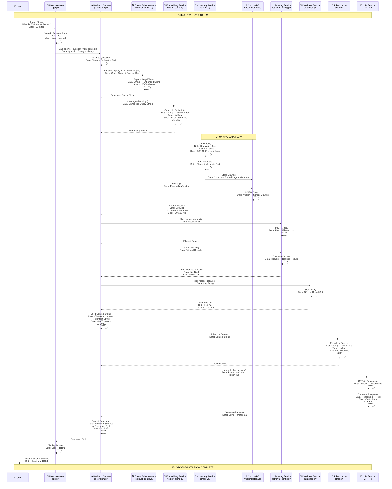
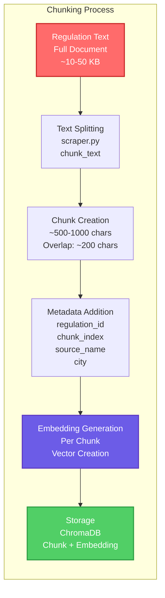
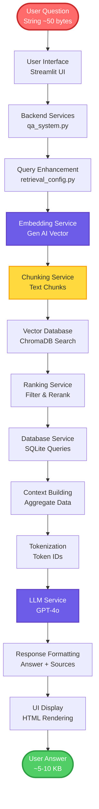

# End-to-End Data Flow Diagram

Complete data flow from user interaction through UI, backend services, chunking, LLM, to final response.

---

## 🔄 Complete End-to-End Data Flow

```mermaid
flowchart TD
    START([👤 User Types Question<br/>'What is ESA law for Dallas?'])<br/>Data: String ~50 bytes
    
    START --> UI[📱 User Interface<br/>Streamlit UI - app.py<br/>st.chat_input<br/>Session State]
    Note1[Data: String → Session State Dict]
    
    UI --> BACKEND1[⚙️ Backend Service<br/>qa_system.py<br/>answer_question_with_context]
    Note2[Data: Question String + Chat History]
    
    BACKEND1 --> VALIDATE[✅ Validation Service<br/>_validate_question<br/>_check_relevance]
    Note3[Data: Validated Question String]
    
    VALIDATE --> ENHANCE[🔍 Query Enhancement<br/>retrieval_config.py<br/>enhance_query_with_terminology]
    Note4[Data: Enhanced Query String<br/>~200-500 bytes]
    
    ENHANCE --> EMBED[🤖 Embedding Generation<br/>vector_store.py<br/>create_embedding]
    Note5[Data: Query String → Embedding Vector<br/>384 or 1536 dimensions<br/>~1.5-6 KB]
    
    EMBED --> VECTOR[💾 Vector Search<br/>vector_store.py<br/>search function]
    Note6[Data: Embedding Vector → Search Query]
    
    VECTOR --> CHUNKING[📄 Chunking Service<br/>scraper.py<br/>chunk_text<br/>Regulation Chunks]
    Note7[Data: Text Chunks<br/>~500-1000 chars each<br/>With Metadata]
    
    CHUNKING --> CHROMADB[(🗄️ ChromaDB<br/>Vector Database<br/>HNSW Index Search)]
    Note8[Data: Chunk Embeddings<br/>Similarity Matching<br/>14 Initial Results]
    
    CHROMADB --> RANK[📊 Ranking Service<br/>retrieval_config.py<br/>filter_by_geography<br/>rerank_results]
    Note9[Data: Ranked Chunks<br/>Top 7 Results<br/>~30-50 KB]
    
    RANK --> DB[💾 Database Service<br/>database.py<br/>get_recent_updates<br/>SQLite Query]
    Note10[Data: Regulation Metadata<br/>Update History<br/>~10-20 KB]
    
    DB --> CONTEXT[📝 Context Building<br/>qa_system.py<br/>Aggregate Data]
    Note11[Data: Context String<br/>Regulations + Updates<br/>~6000 tokens<br/>~20-30 KB]
    
    CONTEXT --> TOKEN[🔢 Tokenization<br/>tiktoken<br/>Token Encoding]
    Note12[Data: Context String → Token IDs<br/>~2000 tokens<br/>~8 KB]
    
    TOKEN --> LLM{🧠 LLM Service<br/>OpenAI GPT-4o<br/>API Available?}
    Note13[Data: Token IDs + Prompt]
    
    LLM -->|Yes| GPT4[GPT-4o Processing<br/>chat.completions.create<br/>Reasoning & Generation]
    Note14[Data: Token IDs → Generated Text<br/>~500 tokens output<br/>~2-5 KB]
    
    LLM -->|No| FREE[Free Mode<br/>_extract_answer_from_context<br/>Keyword Matching]
    Note15[Data: Context String → Extracted Text<br/>~1-2 KB]
    
    GPT4 --> FORMAT[📤 Response Formatting<br/>qa_system.py<br/>Format Answer + Sources]
    FREE --> FORMAT
    Note16[Data: Answer String + Sources List<br/>~5-10 KB]
    
    FORMAT --> UI_DISPLAY[📱 UI Display<br/>app.py<br/>st.chat_message<br/>Display Answer]
    Note17[Data: Formatted Response Dict<br/>→ HTML Rendering]
    
    UI_DISPLAY --> END([👤 User Sees Answer<br/>Answer + Sources + Links])
    
    style START fill:#ff6b6b,stroke:#c92a2a,stroke-width:3px,color:#fff
    style UI fill:#4ecdc4,stroke:#2d8659,stroke-width:2px,color:#fff
    style EMBED fill:#6c5ce7,stroke:#5f3dc4,stroke-width:2px,color:#fff
    style CHUNKING fill:#ffd93d,stroke:#f59f00,stroke-width:2px
    style LLM fill:#6c5ce7,stroke:#5f3dc4,stroke-width:2px,color:#fff
    style GPT4 fill:#6c5ce7,stroke:#5f3dc4,stroke-width:2px,color:#fff
    style END fill:#51cf66,stroke:#2f9e44,stroke-width:3px,color:#fff
```

---

## 📊 Detailed Data Flow with Data Types



---

## 🔄 Simplified Data Flow Path

```mermaid
graph LR
    A[👤 User Input<br/>String: Question] --> B[📱 UI<br/>Streamlit]
    B --> C[⚙️ Backend<br/>qa_system.py]
    C --> D[🔍 Enhancement<br/>Query Expansion]
    D --> E[🤖 Embedding<br/>Gen AI Vector]
    E --> F[📄 Chunking<br/>Text Chunks]
    F --> G[🗄️ Vector DB<br/>ChromaDB]
    G --> H[📊 Ranking<br/>Filter & Sort]
    H --> I[💾 Database<br/>SQLite]
    I --> J[🔢 Tokenization<br/>Token IDs]
    J --> K[🧠 LLM<br/>GPT-4o]
    K --> L[📤 Response<br/>Formatted Answer]
    L --> M[📱 UI Display<br/>HTML]
    M --> N[👤 User Output<br/>Answer + Sources]

    style A fill:#ff6b6b,stroke:#c92a2a,stroke-width:2px,color:#fff
    style E fill:#6c5ce7,stroke:#5f3dc4,stroke-width:2px,color:#fff
    style K fill:#6c5ce7,stroke:#5f3dc4,stroke-width:2px,color:#fff
    style N fill:#51cf66,stroke:#2f9e44,stroke-width:2px,color:#fff
```



---

## 📈 Data Transformation Flow

```mermaid
graph TB
    subgraph "Data Transformation Stages"
        T1["Stage 1: User Input<br/>Type: String<br/>Size: ~50 bytes<br/>Format: Plain Text"]
        
        T2["Stage 2: UI Processing<br/>Type: Dict<br/>Size: ~100 bytes<br/>Format: Session State"]
        
        T3["Stage 3: Backend Processing<br/>Type: String + Dict<br/>Size: ~200 bytes<br/>Format: Question + Context"]
        
        T4["Stage 4: Query Enhancement<br/>Type: String<br/>Size: ~500 bytes<br/>Format: Enhanced Query"]
        
        T5["Stage 5: Embedding Generation<br/>Type: List[float]<br/>Size: ~1.5-6 KB<br/>Format: Vector Array"]
        
        T6["Stage 6: Chunking<br/>Type: List[String]<br/>Size: ~50-100 KB<br/>Format: Text Chunks + Metadata"]
        
        T7["Stage 7: Vector Search<br/>Type: List[Dict]<br/>Size: ~50-100 KB<br/>Format: Search Results"]
        
        T8["Stage 8: Ranking<br/>Type: List[Dict]<br/>Size: ~30-50 KB<br/>Format: Ranked Results"]
        
        T9["Stage 9: Context Building<br/>Type: String<br/>Size: ~20-30 KB<br/>Format: Aggregated Text"]
        
        T10["Stage 10: Tokenization<br/>Type: List[int]<br/>Size: ~8 KB<br/>Format: Token IDs"]
        
        T11["Stage 11: LLM Processing<br/>Type: String<br/>Size: ~2-5 KB<br/>Format: Generated Text"]
        
        T12["Stage 12: Response Formatting<br/>Type: Dict<br/>Size: ~5-10 KB<br/>Format: Answer + Sources"]
        
        T13["Stage 13: UI Display<br/>Type: HTML<br/>Size: ~10-15 KB<br/>Format: Rendered UI"]
    end

    T1 --> T2
    T2 --> T3
    T3 --> T4
    T4 --> T5
    T5 --> T6
    T6 --> T7
    T7 --> T8
    T8 --> T9
    T9 --> T10
    T10 --> T11
    T11 --> T12
    T12 --> T13

    style T1 fill:#ff6b6b,stroke:#c92a2a,stroke-width:2px,color:#fff
    style T5 fill:#6c5ce7,stroke:#5f3dc4,stroke-width:2px,color:#fff
    style T10 fill:#6c5ce7,stroke:#5f3dc4,stroke-width:2px,color:#fff
    style T11 fill:#6c5ce7,stroke:#5f3dc4,stroke-width:2px,color:#fff
    style T13 fill:#51cf66,stroke:#2f9e44,stroke-width:2px,color:#fff
```



---

## 🔍 Chunking Data Flow Detail



---

## 🧠 LLM Data Flow Detail

```mermaid
flowchart TD
    subgraph "LLM Processing Flow"
        L1[Context String<br/>~6000 tokens<br/>~20-30 KB]
        L2[Tokenization<br/>tiktoken<br/>Encode Text]
        L3[Token IDs<br/>List[int]<br/>~2000 tokens]
        L4[Build Prompt<br/>System + User + Context]
        L5[OpenAI API Call<br/>chat.completions.create]
        L6[GPT-4o Processing<br/>Reasoning & Generation]
        L7[Generated Response<br/>String<br/>~500 tokens<br/>~2-5 KB]
        L8[Parse Response<br/>Extract Answer]
        L9[Format Output<br/>Answer + Sources]
    end

    L1 --> L2
    L2 --> L3
    L3 --> L4
    L4 --> L5
    L5 --> L6
    L6 --> L7
    L7 --> L8
    L8 --> L9

    style L1 fill:#ff6b6b,stroke:#c92a2a,stroke-width:2px,color:#fff
    style L3 fill:#6c5ce7,stroke:#5f3dc4,stroke-width:2px,color:#fff
    style L6 fill:#6c5ce7,stroke:#5f3dc4,stroke-width:2px,color:#fff
    style L9 fill:#51cf66,stroke:#2f9e44,stroke-width:2px,color:#fff
```

---

## 📊 Complete Data Flow Summary



---

**Last Updated**: November 2024  
**Focus**: Data Flow Only - User → UI → Backend → Chunking → LLM → End


