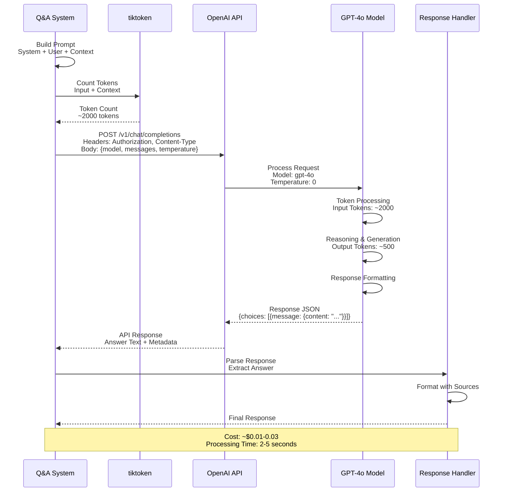

# End-to-End Data Flow Diagram - Intelligence Platform

Complete data flow from user prompt input through all system layers to final response.

---

## 🔄 Complete End-to-End Data Flow

```mermaid
sequenceDiagram
    participant User as 👤 User
    participant Browser as 🌐 Web Browser
    participant Streamlit as 📱 Streamlit UI<br/>app.py
    participant QASystem as 🧠 Q&A System<br/>qa_system.py
    participant Validation as ✅ Validation Layer
    participant Retrieval as 🔍 Retrieval Config<br/>retrieval_config.py
    participant VectorStore as 💾 Vector Store<br/>vector_store.py
    participant ChromaDB as 🗄️ ChromaDB<br/>Vector Database
    participant Embedding as 🤖 Embedding Service
    participant Database as 📊 SQLite Database<br/>database.py
    participant LLM as 🧠 OpenAI GPT-4o<br/>LLM API
    participant Response as 📤 Response Formatter

    Note over User,Response: USER PROMPT INPUT PHASE
    User->>Browser: Types Question/Prompt<br/>"What is ESA law for Dallas?"
    Browser->>Streamlit: HTTP POST Request<br/>User Input Data
    
    Note over Streamlit,QASystem: FRONTEND PROCESSING PHASE
    Streamlit->>Streamlit: Capture User Input<br/>st.chat_input()
    Streamlit->>Streamlit: Store in Session State<br/>chat_history.append()
    Streamlit->>QASystem: answer_question_with_context()<br/>question, chat_history
    
    Note over QASystem,Validation: VALIDATION & ROUTING PHASE
    QASystem->>Validation: _validate_question()<br/>Check Quality & Format
    Validation-->>QASystem: Validation Result<br/>{is_valid: true/false}
    
    alt Invalid Question
        QASystem-->>Streamlit: Error Message
        Streamlit-->>User: Display Error
    end
    
    QASystem->>Validation: _check_relevance()<br/>Check Domain Relevance
    Validation-->>QASystem: Relevance Result<br/>{is_relevant: true/false}
    
    alt Not Relevant
        QASystem-->>Streamlit: "Not relevant" Message
        Streamlit-->>User: Display Message
    end
    
    QASystem->>QASystem: _detect_city()<br/>Extract City from Question
    QASystem-->>QASystem: Detected City: "Dallas"
    
    Note over QASystem,Retrieval: QUERY ENHANCEMENT PHASE
    QASystem->>Retrieval: enhance_query_with_terminology()<br/>Original Query + Context
    Retrieval->>Retrieval: Expand Legal Terms<br/>ESA → "Emotional Support Animal", "ESA", "service animal"
    Retrieval->>Retrieval: Add Synonyms<br/>"law" → "regulation", "statute", "ordinance"
    Retrieval->>Retrieval: Geographic Context<br/>City: "Dallas"
    Retrieval-->>QASystem: Enhanced Query<br/>"Emotional Support Animal ESA service animal law regulation statute ordinance Dallas"
    
    Note over QASystem,ChromaDB: VECTOR SEARCH PHASE
    QASystem->>VectorStore: search()<br/>enhanced_query, n_results=7,<br/>context={city: "Dallas"},<br/>filter_geography="Dallas"
    
    VectorStore->>Retrieval: enhance_query_with_terminology()<br/>Double Enhancement
    Retrieval-->>VectorStore: Final Enhanced Query
    
    VectorStore->>Embedding: create_embedding()<br/>Enhanced Query Text
    
    alt Free Mode (No API Key)
        Embedding->>Embedding: Load Sentence Transformers<br/>all-MiniLM-L6-v2
        Embedding->>Embedding: Encode Query<br/>text → vector (384 dims)
        Embedding-->>VectorStore: Embedding Vector<br/>[0.123, -0.456, ...]
    else Premium Mode (API Key)
        Embedding->>LLM: OpenAI Embeddings API<br/>text-embedding-3-small
        LLM-->>Embedding: Embedding Vector<br/>[0.123, -0.456, ...] (1536 dims)
        Embedding-->>VectorStore: Embedding Vector
    end
    
    VectorStore->>ChromaDB: query()<br/>query_embeddings=[vector],<br/>n_results=14 (2x for reranking)
    ChromaDB->>ChromaDB: HNSW Index Search<br/>Cosine Similarity Matching
    ChromaDB-->>VectorStore: Initial Results<br/>14 regulation chunks + metadata
    
    Note over VectorStore,Database: FILTERING & RERANKING PHASE
    VectorStore->>Retrieval: filter_by_geography()<br/>Results + City="Dallas"
    Retrieval->>Retrieval: Check Metadata<br/>city field, URL patterns
    Retrieval-->>VectorStore: Filtered Results<br/>Dallas-specific regulations
    
    VectorStore->>Retrieval: rerank_results()<br/>Results + Query + Context
    Retrieval->>Retrieval: calculate_source_reliability()<br/>Check .gov, .edu domains
    Retrieval->>Retrieval: Apply Reranking Weights<br/>Distance + Reliability + Geography
    Retrieval-->>VectorStore: Reranked Results<br/>Top 7 most relevant
    
    VectorStore-->>QASystem: Top 7 Regulation Chunks<br/>+ Sources + Metadata
    
    Note over QASystem,Database: CONTEXT BUILDING PHASE
    QASystem->>Database: get_recent_updates()<br/>city="Dallas", limit=3
    Database->>Database: SQL Query<br/>SELECT * FROM updates WHERE...
    Database-->>QASystem: Recent Updates<br/>Last 3 updates for Dallas
    
    QASystem->>QASystem: Build Context String<br/>Regulations + Updates + Chat History
    QASystem-->>QASystem: Full Context<br/>~6000 tokens max
    
    Note over QASystem,LLM: LLM GENERATION PHASE
    QASystem->>QASystem: Check API Availability<br/>OPENAI_API_KEY exists?
    
    alt OpenAI API Available
        QASystem->>LLM: _generate_llm_answer()<br/>Question + Context + City
        QASystem->>LLM: Build Prompt<br/>System Prompt + User Question + Context
        LLM->>LLM: GPT-4o Processing<br/>Temperature=0 (deterministic)
        LLM->>LLM: Token Counting<br/>tiktoken library
        LLM->>LLM: Generate Response<br/>Reasoning + Answer
        LLM-->>QASystem: Detailed Answer<br/>+ Reasoning + Citations
    else Free Mode (No API)
        QASystem->>QASystem: _extract_answer_from_context()<br/>Question + Context
        QASystem->>QASystem: Keyword Matching<br/>Find relevant sentences
        QASystem->>QASystem: Pattern Recognition<br/>Extract answer snippets
        QASystem-->>QASystem: Extracted Answer<br/>From context only
    end
    
    Note over QASystem,Response: RESPONSE FORMATTING PHASE
    QASystem->>Response: Format Response<br/>Answer + Sources + Confidence
    Response->>Response: Add Source Links<br/>URL formatting
    Response->>Response: Add Confidence Score<br/>Based on source count
    Response-->>QASystem: Formatted Response<br/>{answer, sources, confidence}
    
    QASystem-->>Streamlit: Return Response<br/>Answer + Sources + Metadata
    
    Note over Streamlit,User: FRONTEND DISPLAY PHASE
    Streamlit->>Streamlit: Add to Chat History<br/>st.session_state.chat_history
    Streamlit->>Streamlit: Display Answer<br/>st.chat_message("assistant")
    Streamlit->>Streamlit: Display Sources<br/>st.expander("Sources")
    Streamlit->>Browser: Render HTML<br/>Streamlit Components
    Browser-->>User: Display Final Answer<br/>+ Sources + Links
    
    Note over User,Response: END-TO-END COMPLETE
```



---

## 📊 Data Flow Architecture Diagram

```mermaid
flowchart TB
    subgraph "1. User Input Layer"
        USER[👤 User Types Prompt<br/>"What is ESA law for Dallas?"]
        BROWSER[🌐 Web Browser<br/>HTTPS Request]
    end

    subgraph "2. Frontend Layer - Streamlit"
        STREAMLIT[📱 Streamlit UI<br/>app.py]
        CHAT_INPUT[Chat Input Handler<br/>st.chat_input()]
        SESSION[Session State Manager<br/>st.session_state]
    end

    subgraph "3. Validation & Routing Layer"
        VALIDATE[Question Validator<br/>_validate_question()]
        RELEVANCE[Relevance Checker<br/>_check_relevance()]
        CITY_DETECT[City Detector<br/>_detect_city()]
    end

    subgraph "4. Query Enhancement Layer"
        ENHANCE[Query Enhancer<br/>retrieval_config.py]
        TERMINOLOGY[Legal Terminology Expansion<br/>ESA → Multiple Terms]
        SYNONYMS[Synonym Mapping<br/>law → regulation, statute]
        GEO_CONTEXT[Geographic Context<br/>City Filtering]
    end

    subgraph "5. Embedding Generation Layer"
        EMBED_SERVICE[Embedding Service]
        FREE_EMBED[Sentence Transformers<br/>all-MiniLM-L6-v2<br/>384 dimensions]
        PREMIUM_EMBED[OpenAI Embeddings<br/>text-embedding-3-small<br/>1536 dimensions]
    end

    subgraph "6. Vector Search Layer"
        VECTOR_STORE[Vector Store<br/>vector_store.py]
        CHROMADB[(ChromaDB<br/>Vector Database<br/>HNSW Index)]
        SIMILARITY[Cosine Similarity Search<br/>Top K Results]
    end

    subgraph "7. Filtering & Ranking Layer"
        GEO_FILTER[Geographic Filter<br/>filter_by_geography()]
        SOURCE_RANK[Source Reliability<br/>calculate_source_reliability()]
        RERANK[Result Reranking<br/>rerank_results()]
    end

    subgraph "8. Knowledge Base Layer"
        SQLITE[(SQLite Database<br/>Regulation Metadata<br/>Updates History)]
        REG_CHUNKS[Regulation Chunks<br/>Text + Embeddings]
        UPDATES[Recent Updates<br/>Last 24 hours]
    end

    subgraph "9. Context Building Layer"
        CONTEXT_BUILDER[Context Builder<br/>qa_system.py]
        AGGREGATE[Aggregate Regulations<br/>Top 7 Results]
        INTEGRATE[Integrate Updates<br/>Recent Changes]
        HISTORY[Include Chat History<br/>Follow-up Context]
    end

    subgraph "10. LLM Processing Layer"
        LLM_DECISION{API Available?}
        GPT4[OpenAI GPT-4o<br/>• Reasoning<br/>• Analysis<br/>• Generation<br/>Temperature: 0]
        FREE_MODE[Free Mode<br/>• Context Extraction<br/>• Keyword Matching<br/>• Pattern Recognition]
    end

    subgraph "11. Response Generation Layer"
        RESPONSE_FORMAT[Response Formatter]
        SOURCE_LINKS[Source Link Generator]
        CONFIDENCE[Confidence Scorer]
    end

    subgraph "12. Frontend Display Layer"
        CHAT_DISPLAY[Chat Display<br/>st.chat_message()]
        SOURCE_DISPLAY[Source Display<br/>st.expander()]
        HISTORY_UPDATE[Update Chat History]
    end

    %% Flow Connections
    USER --> BROWSER
    BROWSER --> STREAMLIT
    STREAMLIT --> CHAT_INPUT
    CHAT_INPUT --> SESSION
    SESSION --> VALIDATE
    
    VALIDATE --> RELEVANCE
    RELEVANCE --> CITY_DETECT
    CITY_DETECT --> ENHANCE
    
    ENHANCE --> TERMINOLOGY
    ENHANCE --> SYNONYMS
    ENHANCE --> GEO_CONTEXT
    TERMINOLOGY --> EMBED_SERVICE
    SYNONYMS --> EMBED_SERVICE
    GEO_CONTEXT --> EMBED_SERVICE
    
    EMBED_SERVICE --> FREE_EMBED
    EMBED_SERVICE --> PREMIUM_EMBED
    FREE_EMBED --> VECTOR_STORE
    PREMIUM_EMBED --> VECTOR_STORE
    
    VECTOR_STORE --> CHROMADB
    CHROMADB --> SIMILARITY
    SIMILARITY --> GEO_FILTER
    
    GEO_FILTER --> SOURCE_RANK
    SOURCE_RANK --> RERANK
    RERANK --> SQLITE
    RERANK --> REG_CHUNKS
    
    REG_CHUNKS --> CONTEXT_BUILDER
    SQLITE --> UPDATES
    UPDATES --> CONTEXT_BUILDER
    HISTORY --> CONTEXT_BUILDER
    
    CONTEXT_BUILDER --> AGGREGATE
    AGGREGATE --> INTEGRATE
    INTEGRATE --> LLM_DECISION
    
    LLM_DECISION -->|Yes| GPT4
    LLM_DECISION -->|No| FREE_MODE
    GPT4 --> RESPONSE_FORMAT
    FREE_MODE --> RESPONSE_FORMAT
    
    RESPONSE_FORMAT --> SOURCE_LINKS
    RESPONSE_FORMAT --> CONFIDENCE
    SOURCE_LINKS --> CHAT_DISPLAY
    CONFIDENCE --> CHAT_DISPLAY
    CHAT_DISPLAY --> SOURCE_DISPLAY
    SOURCE_DISPLAY --> HISTORY_UPDATE
    HISTORY_UPDATE --> USER

    style USER fill:#ff6b6b,stroke:#c92a2a,stroke-width:3px,color:#fff
    style GPT4 fill:#6c5ce7,stroke:#5f3dc4,stroke-width:3px,color:#fff
    style FREE_MODE fill:#6c5ce7,stroke:#5f3dc4,stroke-width:3px,color:#fff
    style CHROMADB fill:#51cf66,stroke:#2f9e44,stroke-width:2px
    style SQLITE fill:#51cf66,stroke:#2f9e44,stroke-width:2px
```

---

## 🔍 Detailed Component Data Flow

```mermaid
graph LR
    subgraph "Input: User Prompt"
        PROMPT["User Prompt:<br/>'What is ESA law<br/>for Dallas?'"]
    end

    subgraph "Step 1: Frontend Processing"
        F1[Streamlit Receives Input]
        F2[Store in Session State]
        F3[Call QASystem]
    end

    subgraph "Step 2: Validation"
        V1[Validate Question Quality]
        V2[Check Relevance]
        V3[Detect City: Dallas]
    end

    subgraph "Step 3: Query Enhancement"
        Q1[Original: 'ESA law Dallas']
        Q2[Enhanced: 'Emotional Support Animal<br/>ESA service animal<br/>law regulation statute<br/>Dallas Texas']
    end

    subgraph "Step 4: Embedding"
        E1[Text Input]
        E2[Embedding Model]
        E3[Vector Output<br/>384 or 1536 dims]
    end

    subgraph "Step 5: Vector Search"
        VS1[Query Vector]
        VS2[ChromaDB Search]
        VS3[14 Initial Results]
    end

    subgraph "Step 6: Filtering"
        FIL1[Geographic Filter]
        FIL2[Source Reliability]
        FIL3[Top 7 Results]
    end

    subgraph "Step 7: Context Building"
        CB1[Regulation Chunks]
        CB2[Recent Updates]
        CB3[Chat History]
        CB4[Full Context<br/>~6000 tokens]
    end

    subgraph "Step 8: LLM Processing"
        LLM1[GPT-4o or Free Mode]
        LLM2[Reasoning & Analysis]
        LLM3[Generated Answer]
    end

    subgraph "Step 9: Response Formatting"
        RF1[Format Answer]
        RF2[Add Sources]
        RF3[Add Confidence]
    end

    subgraph "Step 10: Display"
        D1[Chat Message]
        D2[Source Links]
        D3[User Sees Answer]
    end

    PROMPT --> F1
    F1 --> F2
    F2 --> F3
    F3 --> V1
    V1 --> V2
    V2 --> V3
    V3 --> Q1
    Q1 --> Q2
    Q2 --> E1
    E1 --> E2
    E2 --> E3
    E3 --> VS1
    VS1 --> VS2
    VS2 --> VS3
    VS3 --> FIL1
    FIL1 --> FIL2
    FIL2 --> FIL3
    FIL3 --> CB1
    CB1 --> CB2
    CB2 --> CB3
    CB3 --> CB4
    CB4 --> LLM1
    LLM1 --> LLM2
    LLM2 --> LLM3
    LLM3 --> RF1
    RF1 --> RF2
    RF2 --> RF3
    RF3 --> D1
    D1 --> D2
    D2 --> D3

    style PROMPT fill:#ff6b6b,stroke:#c92a2a,stroke-width:2px,color:#fff
    style LLM3 fill:#6c5ce7,stroke:#5f3dc4,stroke-width:2px,color:#fff
    style D3 fill:#51cf66,stroke:#2f9e44,stroke-width:2px,color:#fff
```



---

## 📈 Data Transformation Pipeline

```mermaid
graph TB
    subgraph "Data Transformation Stages"
        STAGE1[Raw User Input<br/>String: 'What is ESA law for Dallas?']
        STAGE2[Validated Input<br/>Validated String + Metadata]
        STAGE3[Enhanced Query<br/>Expanded String with Synonyms]
        STAGE4[Embedding Vector<br/>Numerical Array: 384/1536 dims]
        STAGE5[Search Results<br/>Array of Regulation Chunks]
        STAGE6[Filtered Results<br/>Top 7 Relevant Chunks]
        STAGE7[Context String<br/>Aggregated Text: ~6000 tokens]
        STAGE8[LLM Response<br/>Generated Answer Text]
        STAGE9[Formatted Response<br/>Answer + Sources + Metadata]
        STAGE10[Display HTML<br/>Rendered UI Components]
    end

    STAGE1 -->|Validation| STAGE2
    STAGE2 -->|Enhancement| STAGE3
    STAGE3 -->|Embedding| STAGE4
    STAGE4 -->|Vector Search| STAGE5
    STAGE5 -->|Filtering| STAGE6
    STAGE6 -->|Aggregation| STAGE7
    STAGE7 -->|LLM Generation| STAGE8
    STAGE8 -->|Formatting| STAGE9
    STAGE9 -->|Rendering| STAGE10

    style STAGE1 fill:#ff6b6b,stroke:#c92a2a,stroke-width:2px,color:#fff
    STAGE4 fill:#6c5ce7,stroke:#5f3dc4,stroke-width:2px,color:#fff
    STAGE8 fill:#51cf66,stroke:#2f9e44,stroke-width:2px,color:#fff
    STAGE10 fill:#4ecdc4,stroke:#2d8659,stroke-width:2px,color:#fff
```

---

## 🔄 API Call Flow (LLM Processing)



---

## 📊 Data Size & Performance Metrics

```mermaid
graph TB
    subgraph "Data Size at Each Stage"
        SIZE1[User Input<br/>~50 bytes<br/>1-2 sentences]
        SIZE2[Enhanced Query<br/>~200 bytes<br/>Expanded terms]
        SIZE3[Embedding Vector<br/>1.5-6 KB<br/>384-1536 floats]
        SIZE4[Search Results<br/>~50-100 KB<br/>7 regulation chunks]
        SIZE5[Context String<br/>~20-30 KB<br/>~6000 tokens]
        SIZE6[LLM Request<br/>~25-35 KB<br/>Prompt + Context]
        SIZE7[LLM Response<br/>~2-5 KB<br/>Generated answer]
        SIZE8[Final Response<br/>~5-10 KB<br/>Answer + Sources]
    end

    SIZE1 --> SIZE2
    SIZE2 --> SIZE3
    SIZE3 --> SIZE4
    SIZE4 --> SIZE5
    SIZE5 --> SIZE6
    SIZE6 --> SIZE7
    SIZE7 --> SIZE8

    style SIZE1 fill:#ff6b6b,stroke:#c92a2a,stroke-width:2px,color:#fff
    SIZE3 fill:#6c5ce7,stroke:#5f3dc4,stroke-width:2px,color:#fff
    SIZE7 fill:#51cf66,stroke:#2f9e44,stroke-width:2px,color:#fff
```

---

## ⚡ Performance Timeline

```mermaid
gantt
    title End-to-End Processing Timeline
    dateFormat X
    axisFormat %Ls
    
    section User Input
    Browser Send Request           :0, 50ms
    
    section Frontend
    Streamlit Processing           :50ms, 100ms
    
    section Validation
    Question Validation            :150ms, 50ms
    Relevance Check                :200ms, 50ms
    City Detection                 :250ms, 50ms
    
    section Query Enhancement
    Terminology Expansion          :300ms, 100ms
    Synonym Mapping                :400ms, 50ms
    
    section Embedding
    Embedding Generation           :450ms, 500ms
    
    section Vector Search
    ChromaDB Query                 :950ms, 200ms
    Similarity Matching            :1150ms, 100ms
    
    section Filtering
    Geographic Filter              :1250ms, 50ms
    Source Ranking                :1300ms, 50ms
    Result Reranking               :1350ms, 50ms
    
    section Context Building
    Database Query                 :1400ms, 100ms
    Context Aggregation            :1500ms, 100ms
    
    section LLM Processing
    API Call (if available)       :1600ms, 3000ms
    Free Mode Processing           :1600ms, 500ms
    
    section Response
    Response Formatting            :4600ms, 100ms
    Frontend Rendering             :4700ms, 200ms
    
    section Display
    User Sees Answer               :4900ms, 100ms
```

---

## 🎯 Key Data Flow Points

### **1. Input Stage**
- **Data Type**: String (user prompt)
- **Size**: ~50-200 bytes
- **Format**: Plain text question

### **2. Processing Stage**
- **Data Type**: Enhanced string + metadata
- **Size**: ~200-500 bytes
- **Format**: Expanded query with context

### **3. Embedding Stage**
- **Data Type**: Numerical vector
- **Size**: 1.5-6 KB (384 or 1536 dimensions)
- **Format**: Float array

### **4. Search Stage**
- **Data Type**: Array of regulation chunks
- **Size**: ~50-100 KB
- **Format**: JSON-like structure with metadata

### **5. Context Stage**
- **Data Type**: Aggregated text
- **Size**: ~20-30 KB
- **Format**: Plain text with structure

### **6. LLM Stage**
- **Data Type**: Generated text
- **Size**: ~2-5 KB
- **Format**: Markdown-formatted answer

### **7. Output Stage**
- **Data Type**: Formatted response
- **Size**: ~5-10 KB
- **Format**: HTML/Streamlit components

---

## 📝 Notes

- **Total Processing Time**: 2-5 seconds (with API), 1-2 seconds (free mode)
- **Data Transformation**: String → Vector → Chunks → Context → Answer
- **API Calls**: 1-2 calls (embedding + LLM, if API available)
- **Database Queries**: 1-2 queries (regulations + updates)
- **Vector Searches**: 1 search with reranking

---

**Last Updated**: November 2024  
**Based on**: Actual codebase implementation


