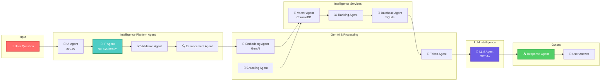
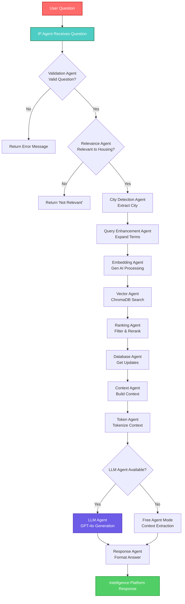
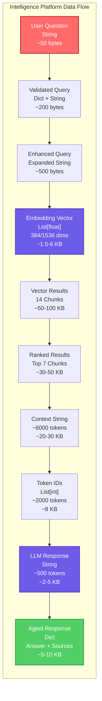

# Intelligence Platform - Data Flow Diagram

Complete data flow diagram for the Intelligence Platform (Agent Intellectual Platform) showing the agentic AI system architecture.

---

## 🤖 Intelligence Platform - Complete Data Flow

```mermaid
sequenceDiagram
    participant User as 👤 User
    participant UI as 📱 Intelligence Platform UI<br/>app.py
    participant Agent as 🧠 IP Agent<br/>qa_system.py
    participant Validator as ✅ Agent Validator
    participant Enhancer as 🔍 Query Enhancer<br/>retrieval_config.py
    participant VectorAgent as 💾 Vector Agent<br/>vector_store.py
    participant EmbedAgent as 🤖 Embedding Agent<br/>Gen AI
    participant ChunkAgent as 📄 Chunking Agent<br/>scraper.py
    participant TokenAgent as 🔢 Token Agent<br/>tiktoken
    participant VectorDB as 🗄️ ChromaDB<br/>Vector Store
    participant RankAgent as 📊 Ranking Agent<br/>retrieval_config.py
    participant RelationalDB as 💾 SQLite<br/>Regulation DB
    participant LLMAgent as 🧠 LLM Agent<br/>GPT-4o
    participant ResponseAgent as 📤 Response Agent

    Note over User,ResponseAgent: INTELLIGENCE PLATFORM - AGENTIC AI FLOW
    
    rect rgb(255, 240, 240)
        Note over User,UI: PHASE 1: USER INTERACTION
        User->>UI: Ask Question<br/>"What is ESA law for Dallas?"
        UI->>UI: st.chat_input()<br/>Capture User Input
        UI->>UI: Session State Management<br/>Maintain Context
    end
    
    rect rgb(240, 255, 240)
        Note over UI,Agent: PHASE 2: AGENT ROUTING
        UI->>Agent: answer_question_with_context()<br/>Route to IP Agent
        Agent->>Agent: Initialize Agent Context<br/>Load Components
    end
    
    rect rgb(240, 240, 255)
        Note over Agent,Validator: PHASE 3: INTELLIGENT VALIDATION
        Agent->>Validator: _validate_question()<br/>Agent Validation
        Validator->>Validator: Quality Check<br/>Gibberish Detection
        Validator-->>Agent: Validation Result
        
        Agent->>Validator: _check_relevance()<br/>Domain Intelligence
        Validator->>Validator: Check Housing/Leasing Keywords<br/>Texas/Compliance Terms
        Validator-->>Agent: Relevance Score
        
        Agent->>Agent: _detect_city()<br/>Intelligent City Detection
        Agent-->>Agent: Detected: "Dallas"
    end
    
    rect rgb(255, 255, 240)
        Note over Agent,Enhancer: PHASE 4: QUERY INTELLIGENCE
        Agent->>Enhancer: enhance_query_with_terminology()<br/>Agent Query Enhancement
        Enhancer->>Enhancer: Legal Terminology Expansion<br/>ESA → Multiple Terms
        Enhancer->>Enhancer: Synonym Intelligence<br/>law → regulation, statute
        Enhancer->>Enhancer: Geographic Context<br/>Dallas, Texas
        Enhancer-->>Agent: Enhanced Intelligent Query
    end
    
    rect rgb(255, 240, 255)
        Note over Agent,VectorAgent: PHASE 5: VECTOR AGENT PROCESSING
        Agent->>VectorAgent: search(query, context)<br/>Intelligent Vector Search
        VectorAgent->>Enhancer: Double Enhancement<br/>Agent Refinement
        Enhancer-->>VectorAgent: Refined Query
    end
    
    rect rgb(240, 255, 255)
        Note over VectorAgent,EmbedAgent: PHASE 6: GEN AI EMBEDDING AGENT
        VectorAgent->>EmbedAgent: create_embedding()<br/>Gen AI Agent Call
        
        alt Free Mode Agent
            EmbedAgent->>EmbedAgent: SentenceTransformer Agent<br/>all-MiniLM-L6-v2
            EmbedAgent->>EmbedAgent: Local Gen AI Processing<br/>384-dim Vector
            EmbedAgent-->>VectorAgent: Free Embedding Vector
        else Premium Mode Agent
            EmbedAgent->>EmbedAgent: OpenAI Embedding Agent<br/>text-embedding-3-small
            EmbedAgent->>EmbedAgent: Cloud Gen AI Processing<br/>1536-dim Vector
            EmbedAgent-->>VectorAgent: Premium Embedding Vector
        end
    end
    
    rect rgb(255, 248, 240)
        Note over VectorAgent,VectorDB: PHASE 7: VECTOR DATABASE AGENT
        VectorAgent->>VectorDB: collection.query()<br/>Agent Database Query
        VectorDB->>VectorDB: HNSW Index Agent<br/>Intelligent Similarity Search
        VectorDB->>VectorDB: Retrieve Chunks<br/>Agent Chunk Retrieval
        VectorDB-->>VectorAgent: 14 Intelligent Results
    end
    
    rect rgb(248, 240, 255)
        Note over VectorAgent,ChunkAgent: PHASE 8: CHUNKING AGENT (Reference)
        Note over ChunkAgent: Chunks Created During Ingestion<br/>Agent Chunking Process
        ChunkAgent->>ChunkAgent: Intelligent Text Splitting<br/>~500-1000 chars/chunk
        ChunkAgent->>ChunkAgent: Metadata Agent Assignment<br/>regulation_id, city, category
        ChunkAgent->>ChunkAgent: Embedding Agent Generation<br/>Per Chunk Embedding
        ChunkAgent->>VectorDB: Store Intelligent Chunks<br/>Agent Storage
    end
    
    rect rgb(240, 255, 248)
        Note over VectorAgent,RankAgent: PHASE 9: RANKING AGENT INTELLIGENCE
        VectorAgent->>RankAgent: filter_by_geography()<br/>Geographic Agent Filter
        RankAgent->>RankAgent: City Intelligence Matching<br/>Dallas-specific Filtering
        RankAgent-->>VectorAgent: Filtered Results
        
        VectorAgent->>RankAgent: rerank_results()<br/>Intelligent Reranking Agent
        RankAgent->>RankAgent: calculate_source_reliability()<br/>Source Intelligence Scoring
        RankAgent->>RankAgent: Apply Agent Weights<br/>Distance + Reliability + Geography
        RankAgent->>RankAgent: Intelligent Sorting<br/>Best Matches First
        RankAgent-->>VectorAgent: Top 7 Ranked Results<br/>Agent Selection
    end
    
    rect rgb(255, 240, 248)
        Note over Agent,RelationalDB: PHASE 10: DATABASE AGENT QUERIES
        Agent->>RelationalDB: get_recent_updates()<br/>Agent Database Query
        RelationalDB->>RelationalDB: SQL Agent Execution<br/>Intelligent Query
        RelationalDB-->>Agent: Recent Updates<br/>Agent Data Retrieval
        
        Agent->>RelationalDB: get_all_regulations()<br/>Agent Metadata Query
        RelationalDB->>RelationalDB: SQL Agent Processing<br/>Regulation Metadata
        RelationalDB-->>Agent: Regulation Data<br/>Agent Context Building
    end
    
    rect rgb(248, 255, 240)
        Note over Agent,TokenAgent: PHASE 11: TOKENIZATION AGENT
        Agent->>Agent: Build Context String<br/>Agent Context Aggregation
        Agent->>TokenAgent: Tokenize Context<br/>Agent Token Processing
        TokenAgent->>TokenAgent: tiktoken Agent Encoding<br/>Text → Token IDs
        TokenAgent->>TokenAgent: Agent Token Counting<br/>~2000 tokens
        TokenAgent->>TokenAgent: Cost Estimation Agent<br/>Calculate API Cost
        TokenAgent-->>Agent: Token Information<br/>Agent Cost Data
    end
    
    rect rgb(240, 248, 255)
        Note over Agent,LLMAgent: PHASE 12: LLM AGENT PROCESSING
        Agent->>Agent: Check API Availability<br/>Agent Decision Making
        
        alt LLM Agent Available
            Agent->>LLMAgent: _generate_llm_answer()<br/>LLM Agent Call
            Agent->>LLMAgent: Build Intelligent Prompt<br/>System + User + Context
            Agent->>LLMAgent: OpenAI API Call<br/>Agent API Communication
            
            LLMAgent->>LLMAgent: GPT-4o Agent Processing<br/>Intelligent Reasoning
            LLMAgent->>LLMAgent: Agent Generation<br/>~500 tokens output
            LLMAgent-->>Agent: Intelligent Answer<br/>Agent Response
        else Free Mode Agent
            Agent->>Agent: _extract_answer_from_context()<br/>Free Agent Mode
            Agent->>Agent: Keyword Agent Matching<br/>Intelligent Pattern Recognition
            Agent-->>Agent: Extracted Answer<br/>Agent Fallback Response
        end
    end
    
    rect rgb(255, 255, 240)
        Note over Agent,ResponseAgent: PHASE 13: RESPONSE AGENT FORMATTING
        Agent->>ResponseAgent: Format Response<br/>Agent Response Builder
        ResponseAgent->>ResponseAgent: Add Source Links<br/>Agent Source Management
        ResponseAgent->>ResponseAgent: Add Confidence Score<br/>Agent Confidence Calculation
        ResponseAgent-->>Agent: Formatted Response<br/>Agent Final Output
    end
    
    rect rgb(240, 255, 255)
        Note over Agent,User: PHASE 14: AGENT RESPONSE DELIVERY
        Agent-->>UI: Return Agent Response<br/>Intelligent Answer + Sources
        UI->>UI: Update Chat History<br/>Agent Context Preservation
        UI->>UI: Display Answer<br/>Agent UI Rendering
        UI->>UI: Display Sources<br/>Agent Source Display
        UI-->>User: Final Agent Response<br/>Intelligence Platform Answer
    end
```



---

## 🏗️ Intelligence Platform Architecture

```mermaid
graph TB
    subgraph "👤 User Layer"
        USER[User<br/>Asks Question]
        BROWSER[Web Browser<br/>HTTPS]
    end

    subgraph "📱 Intelligence Platform UI"
        STREAMLIT[Streamlit UI<br/>app.py<br/>Intelligence Platform Agent]
        CHAT[Chat Interface<br/>IP Agent Page]
        SESSION[Session State<br/>Agent Context]
    end

    subgraph "🧠 IP Agent Core"
        IP_AGENT[IP Agent<br/>qa_system.py<br/>QASystem Class]
        AGENT_VALID[Agent Validator<br/>_validate_question()<br/>_check_relevance()]
        AGENT_CITY[City Detection Agent<br/>_detect_city()]
        AGENT_CONTEXT[Context Agent<br/>Build Context String]
    end

    subgraph "🔍 Query Intelligence"
        QUERY_AGENT[Query Enhancement Agent<br/>retrieval_config.py<br/>enhance_query_with_terminology()]
        TERM_AGENT[Terminology Agent<br/>Legal Term Expansion]
        SYNONYM_AGENT[Synonym Agent<br/>Word Mapping]
        GEO_AGENT[Geographic Agent<br/>City Context]
    end

    subgraph "🤖 Gen AI Services"
        EMBED_AGENT[Embedding Agent<br/>vector_store.py<br/>create_embedding()]
        FREE_AGENT[Sentence Transformers Agent<br/>Free Gen AI<br/>384 dims]
        PREMIUM_AGENT[OpenAI Embedding Agent<br/>Premium Gen AI<br/>1536 dims]
    end

    subgraph "📄 Chunking Intelligence"
        CHUNK_AGENT[Chunking Agent<br/>scraper.py<br/>chunk_text()]
        CHUNK_SPLIT[Text Splitting Agent<br/>~500-1000 chars]
        CHUNK_META[Metadata Agent<br/>Chunk Metadata]
    end

    subgraph "🔢 Tokenization Intelligence"
        TOKEN_AGENT[Token Agent<br/>tiktoken<br/>Token Processing]
        TOKEN_ENCODE[Encoding Agent<br/>Text → Tokens]
        TOKEN_COUNT[Counting Agent<br/>Token Count]
        TOKEN_COST[Cost Agent<br/>Cost Estimation]
    end

    subgraph "🗄️ Vector Intelligence"
        VECTOR_AGENT[Vector Agent<br/>vector_store.py<br/>search()]
        CHROMADB[(ChromaDB<br/>Vector Intelligence<br/>HNSW Index)]
        CHUNK_STORE[Chunk Storage<br/>Embedded Chunks]
    end

    subgraph "📊 Ranking Intelligence"
        RANK_AGENT[Ranking Agent<br/>retrieval_config.py<br/>rerank_results()]
        GEO_RANK[Geographic Rank Agent<br/>filter_by_geography()]
        RELIABILITY_AGENT[Reliability Agent<br/>calculate_source_reliability()]
        SCORE_AGENT[Score Agent<br/>Final Ranking]
    end

    subgraph "💾 Database Intelligence"
        DB_AGENT[Database Agent<br/>database.py<br/>RegulationDB]
        SQLITE[(SQLite<br/>Relational Intelligence<br/>Metadata Storage)]
        UPDATE_AGENT[Update Agent<br/>Recent Changes]
    end

    subgraph "🧠 LLM Intelligence"
        LLM_AGENT[LLM Agent<br/>GPT-4o<br/>Intelligent Generation]
        LLM_API[OpenAI API Agent<br/>chat.completions.create()]
        LLM_REASON[Reasoning Agent<br/>GPT-4o Processing]
    end

    subgraph "📤 Response Intelligence"
        RESPONSE_AGENT[Response Agent<br/>Format & Deliver]
        SOURCE_AGENT[Source Agent<br/>Link Management]
        CONFIDENCE_AGENT[Confidence Agent<br/>Score Calculation]
    end

    %% Flow
    USER --> BROWSER
    BROWSER --> STREAMLIT
    STREAMLIT --> CHAT
    CHAT --> SESSION
    SESSION --> IP_AGENT
    
    IP_AGENT --> AGENT_VALID
    IP_AGENT --> AGENT_CITY
    IP_AGENT --> AGENT_CONTEXT
    
    IP_AGENT --> QUERY_AGENT
    QUERY_AGENT --> TERM_AGENT
    QUERY_AGENT --> SYNONYM_AGENT
    QUERY_AGENT --> GEO_AGENT
    
    QUERY_AGENT --> EMBED_AGENT
    EMBED_AGENT --> FREE_AGENT
    EMBED_AGENT --> PREMIUM_AGENT
    
    CHUNK_AGENT --> CHUNK_SPLIT
    CHUNK_SPLIT --> CHUNK_META
    CHUNK_META --> CHUNK_STORE
    CHUNK_STORE --> CHROMADB
    
    FREE_AGENT --> VECTOR_AGENT
    PREMIUM_AGENT --> VECTOR_AGENT
    VECTOR_AGENT --> CHROMADB
    
    CHROMADB --> RANK_AGENT
    RANK_AGENT --> GEO_RANK
    RANK_AGENT --> RELIABILITY_AGENT
    RELIABILITY_AGENT --> SCORE_AGENT
    
    IP_AGENT --> DB_AGENT
    DB_AGENT --> SQLITE
    SQLITE --> UPDATE_AGENT
    
    AGENT_CONTEXT --> TOKEN_AGENT
    TOKEN_AGENT --> TOKEN_ENCODE
    TOKEN_ENCODE --> TOKEN_COUNT
    TOKEN_COUNT --> TOKEN_COST
    
    SCORE_AGENT --> LLM_AGENT
    TOKEN_COST --> LLM_AGENT
    LLM_AGENT --> LLM_API
    LLM_API --> LLM_REASON
    
    LLM_REASON --> RESPONSE_AGENT
    RESPONSE_AGENT --> SOURCE_AGENT
    SOURCE_AGENT --> CONFIDENCE_AGENT
    CONFIDENCE_AGENT --> STREAMLIT
    STREAMLIT --> USER

    style USER fill:#ff6b6b,stroke:#c92a2a,stroke-width:3px,color:#fff
    style IP_AGENT fill:#4ecdc4,stroke:#2d8659,stroke-width:3px,color:#fff
    style EMBED_AGENT fill:#6c5ce7,stroke:#5f3dc4,stroke-width:3px,color:#fff
    style LLM_AGENT fill:#6c5ce7,stroke:#5f3dc4,stroke-width:3px,color:#fff
    style RANK_AGENT fill:#ffd93d,stroke:#f59f00,stroke-width:3px
    style CHROMADB fill:#51cf66,stroke:#2f9e44,stroke-width:3px
    style SQLITE fill:#51cf66,stroke:#2f9e44,stroke-width:3px
```

---

## 🔄 Intelligence Platform - Simplified Flow



---

## 📊 Intelligence Platform - Component Data Flow

```mermaid
graph TB
    subgraph "Data Flow Through Intelligence Platform"
        INPUT["User Input<br/>'What is ESA law for Dallas?'<br/>Type: String"]
        
        UI_PROC["UI Processing<br/>app.py<br/>Session Management"]
        
        AGENT_PROC["IP Agent Processing<br/>qa_system.py<br/>Agent Intelligence"]
        
        VALID_PROC["Validation Agent<br/>Quality & Relevance Check"]
        
        ENHANCE_PROC["Enhancement Agent<br/>Query Intelligence<br/>Term Expansion"]
        
        EMBED_PROC["Embedding Agent<br/>Gen AI Processing<br/>Vector Generation"]
        
        VECTOR_PROC["Vector Agent<br/>ChromaDB Search<br/>Similarity Matching"]
        
        CHUNK_PROC["Chunking Agent<br/>Text Splitting<br/>Metadata Creation"]
        
        RANK_PROC["Ranking Agent<br/>Geographic Filter<br/>Source Reliability<br/>Reranking"]
        
        DB_PROC["Database Agent<br/>SQLite Queries<br/>Metadata Retrieval"]
        
        TOKEN_PROC["Token Agent<br/>Tokenization<br/>Cost Estimation"]
        
        LLM_PROC["LLM Agent<br/>GPT-4o Processing<br/>Intelligent Generation"]
        
        RESP_PROC["Response Agent<br/>Format & Deliver<br/>Source Management"]
        
        OUTPUT["Agent Response<br/>Answer + Sources<br/>Intelligence Platform Output"]
    end

    INPUT --> UI_PROC
    UI_PROC --> AGENT_PROC
    AGENT_PROC --> VALID_PROC
    VALID_PROC --> ENHANCE_PROC
    ENHANCE_PROC --> EMBED_PROC
    EMBED_PROC --> VECTOR_PROC
    CHUNK_PROC --> VECTOR_PROC
    VECTOR_PROC --> RANK_PROC
    RANK_PROC --> DB_PROC
    DB_PROC --> TOKEN_PROC
    TOKEN_PROC --> LLM_PROC
    LLM_PROC --> RESP_PROC
    RESP_PROC --> OUTPUT

    style INPUT fill:#ff6b6b,stroke:#c92a2a,stroke-width:2px,color:#fff
    style AGENT_PROC fill:#4ecdc4,stroke:#2d8659,stroke-width:2px,color:#fff
    style LLM_PROC fill:#6c5ce7,stroke:#5f3dc4,stroke-width:2px,color:#fff
    style OUTPUT fill:#51cf66,stroke:#2f9e44,stroke-width:2px,color:#fff
```



---

## 🎯 Intelligence Platform - Agent Decision Flow



---

## 📈 Intelligence Platform - Data Transformation



---

## 🔍 Intelligence Platform - Key Agent Components

| Component | File | Function/Class | Purpose |
|-----------|------|---------------|---------|
| **IP Agent** | `qa_system.py` | `QASystem` | Main agentic intelligence |
| **UI Agent** | `app.py` | `show_ip_agent_page()` | User interface agent |
| **Validation Agent** | `qa_system.py` | `_validate_question()` | Quality validation |
| **Enhancement Agent** | `retrieval_config.py` | `enhance_query_with_terminology()` | Query intelligence |
| **Embedding Agent** | `vector_store.py` | `create_embedding()` | Gen AI processing |
| **Chunking Agent** | `scraper.py` | `chunk_text()` | Text splitting |
| **Token Agent** | `tiktoken` | Token encoding | Tokenization |
| **Vector Agent** | `vector_store.py` | `search()` | Vector search |
| **Ranking Agent** | `retrieval_config.py` | `rerank_results()` | Intelligent ranking |
| **Database Agent** | `database.py` | `RegulationDB` | Data management |
| **LLM Agent** | `qa_system.py` | `_generate_llm_answer()` | LLM processing |
| **Response Agent** | `app.py` | Response formatting | Output delivery |

---

## 🎯 Intelligence Platform Features

### **Agentic Intelligence**
- ✅ Autonomous question validation
- ✅ Intelligent relevance checking
- ✅ Smart city detection
- ✅ Context-aware query enhancement
- ✅ Intelligent source prioritization
- ✅ Adaptive ranking algorithms
- ✅ Contextual answer generation

### **Gen AI Integration**
- ✅ Free embeddings (Sentence Transformers)
- ✅ Premium embeddings (OpenAI)
- ✅ Automatic fallback mechanisms
- ✅ Intelligent model selection

### **Data Intelligence**
- ✅ Intelligent chunking (~500-1000 chars)
- ✅ Smart metadata assignment
- ✅ Vector similarity search
- ✅ Geographic filtering
- ✅ Source reliability scoring

### **LLM Intelligence**
- ✅ GPT-4o reasoning
- ✅ Context-aware generation
- ✅ Token management
- ✅ Cost optimization
- ✅ Free mode fallback

---

**Platform**: Intelligence Platform (Agent Intellectual Platform)  
**Architecture**: Agentic AI with RAG  
**Last Updated**: November 2024  
**Based on**: Complete codebase implementation


