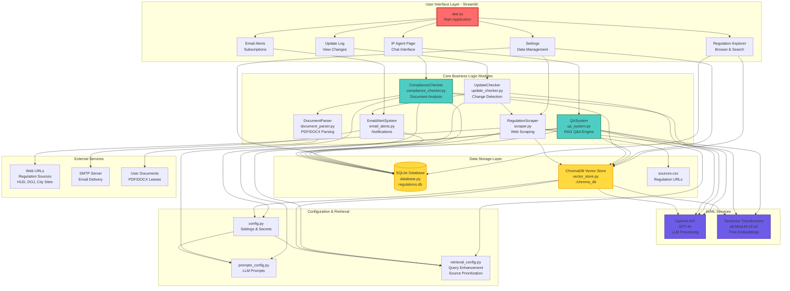
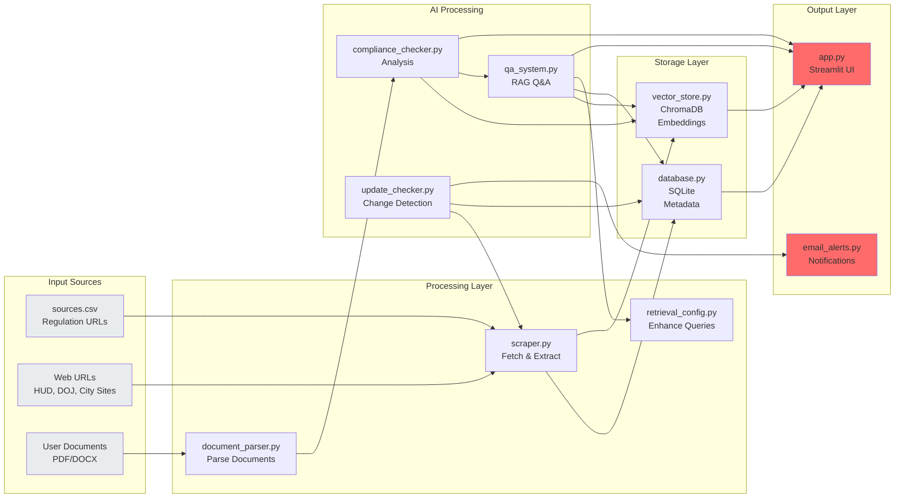
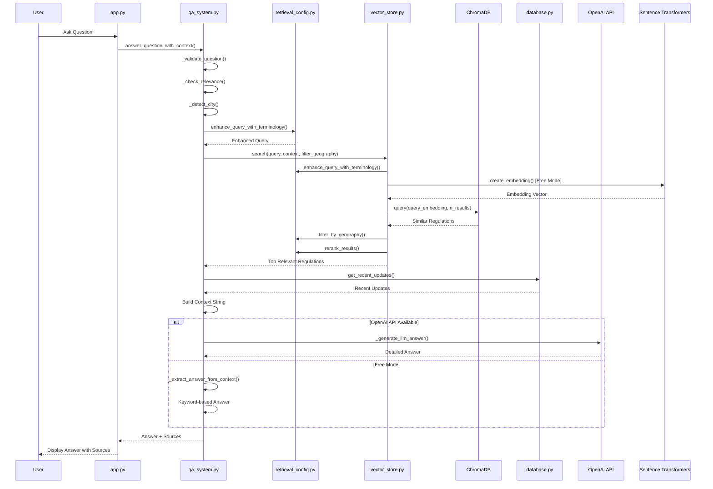
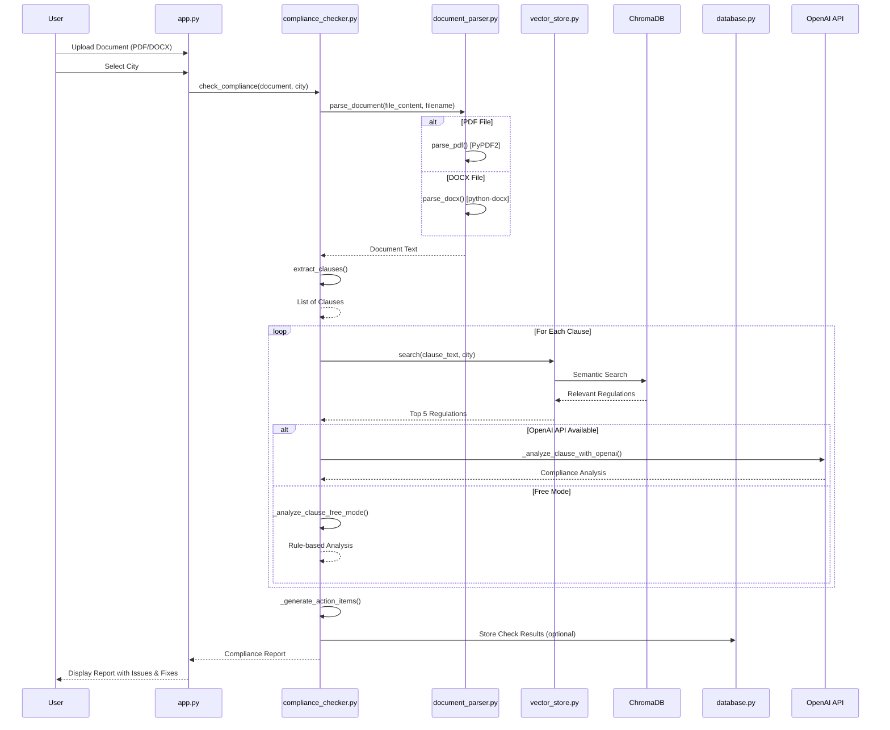
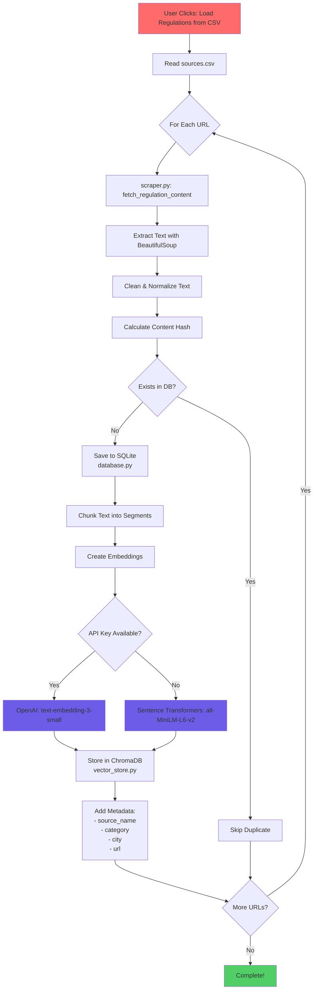
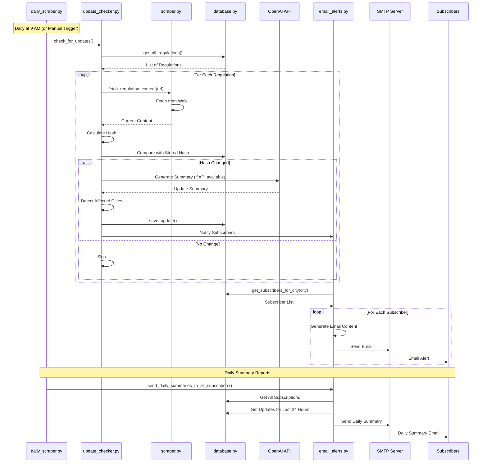
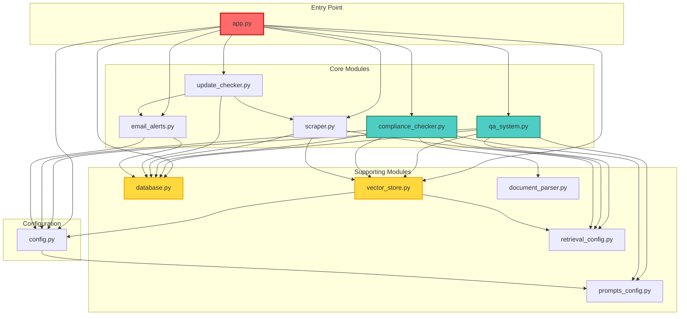
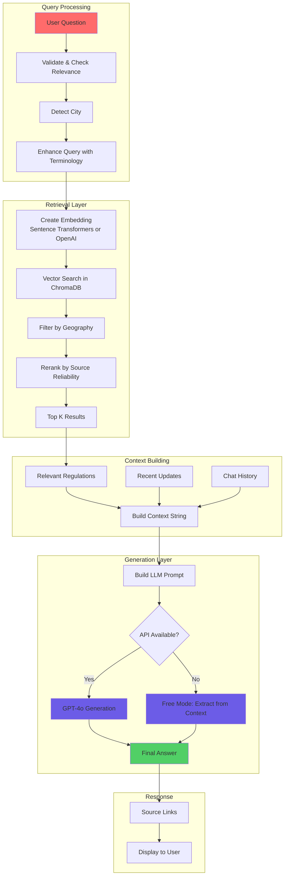
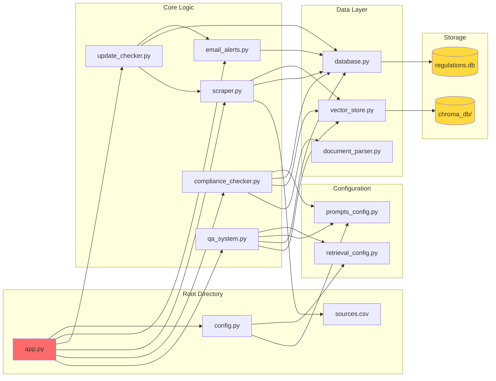
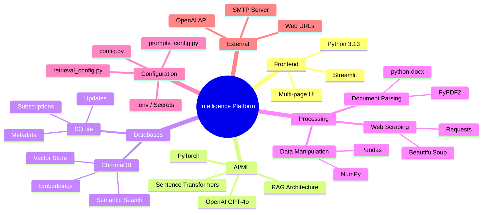

# Mermaid Architecture Diagrams - Intelligence Platform

Complete architecture diagrams based on the actual codebase implementation.

---

## 🏗️ System Architecture Overview

---

## 🔄 Component Interaction Diagram

---

## 📊 Data Flow: Q&A (RAG Pipeline)

---

## 📋 Data Flow: Compliance Checking

---

## 🔄 Data Flow: Regulation Ingestion

---

## 🔔 Data Flow: Update Detection & Email Alerts

---

## 🗂️ Module Dependency Graph

---

## 🔍 RAG (Retrieval Augmented Generation) Architecture

---

## 📁 File Structure with Relationships

---

## 🎯 Technology Stack Visualization

---

## 📝 Notes

- **All diagrams are based on actual code** from the project
- **Module names match actual file names** in the codebase
- **Data flows reflect real function calls** and interactions
- **Technology choices** match `requirements.txt` and imports

---

**Last Updated**: November 2024  
**Based on**: Actual codebase analysis

