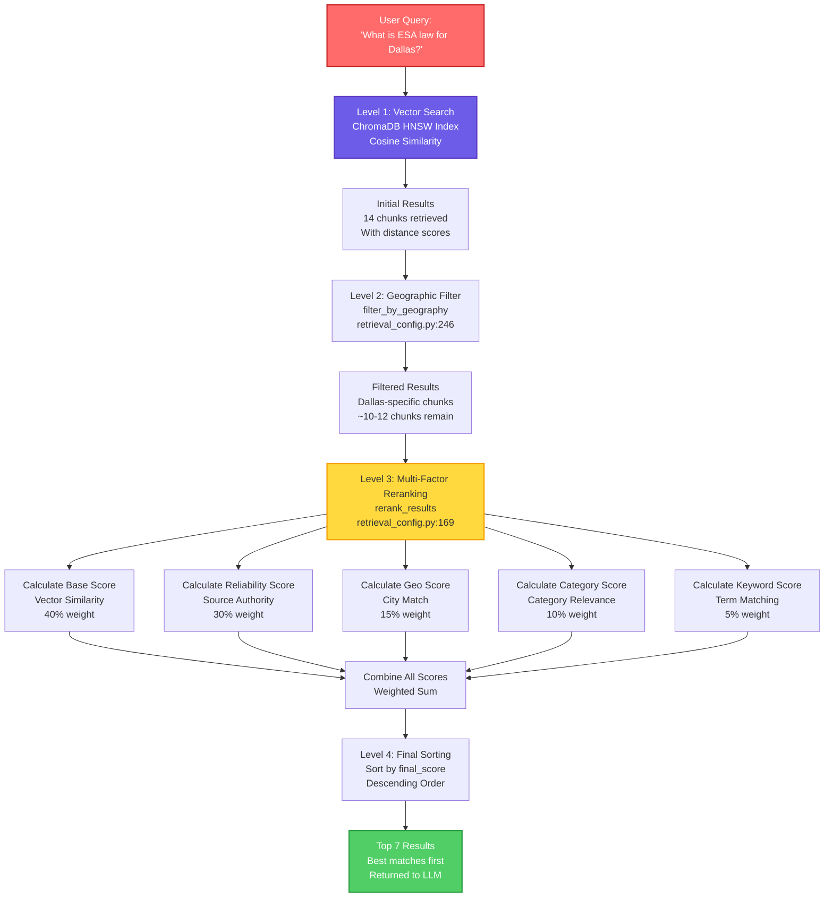

# RAG Ranking System - Detailed Explanation

Complete breakdown of how ranking is performed in the RAG system, with specific levels, order of operations, and examples.

---

## 📊 Ranking Levels Overview

The ranking system operates through **4 distinct levels** in a specific order:

1. **Level 1: Vector Search (ChromaDB)** - Initial similarity-based retrieval
2. **Level 2: Geographic Filtering** - City/location-based filtering
3. **Level 3: Multi-Factor Reranking** - Comprehensive scoring system
4. **Level 4: Final Sorting** - Descending order by final score

---

## 🔄 Complete Ranking Flow



---

## 📍 Level 1: Vector Search (ChromaDB)

**Location**: `vector_store.py:146-150`

**What Happens**:
- Query embedding is created from enhanced query
- ChromaDB performs HNSW index search using cosine similarity
- Returns initial results with distance scores (lower = more similar)

**Code**:
```python
# vector_store.py:146-150
results = self.collection.query(
    query_embeddings=[query_embedding],
    n_results=initial_n,  # n_results * 2 = 14 (if prioritize_reliable=True)
    where=where if where else None
)
```

**Example**:
- Query: "What is ESA law for Dallas?"
- Enhanced Query: "What is ESA law for Dallas? emotional support animal reasonable accommodation fair housing texas dallas"
- Initial Results: **14 chunks** retrieved
- Each result has:
  - `document`: Text content
  - `distance`: Cosine distance (0.0 = identical, 1.0 = completely different)
  - `metadata`: Source info, URL, category

**Sample Initial Results**:
```
Result 1: distance=0.15, document="ESA regulations in Dallas require...", metadata={url: "dallas.gov/esa", category: "ESA"}
Result 2: distance=0.22, document="Fair Housing Act applies to...", metadata={url: "hud.gov/fairhousing", category: "Fair Housing"}
Result 3: distance=0.28, document="Texas state law on emotional support...", metadata={url: "texas.gov/housing", category: "ESA"}
Result 4: distance=0.31, document="Dallas city ordinances...", metadata={url: "dallas.gov/ordinances", category: "Landlord/Tenant"}
...
Result 14: distance=0.65, document="General housing information...", metadata={url: "blog.com/housing", category: "News"}
```

---

## 🌍 Level 2: Geographic Filtering

**Location**: `retrieval_config.py:246-277`  
**Function**: `filter_by_geography()`

**What Happens**:
- Filters results to keep only those relevant to the specified city
- Checks document text, source name, and URL for city keywords
- Falls back to original results if filtering removes everything

**Code**:
```python
# retrieval_config.py:246-277
def filter_by_geography(results: List[Dict], city: Optional[str] = None) -> List[Dict]:
    if not city or city == "Texas-Statewide":
        return results
    
    city_lower = city.lower()
    city_keywords = GEOGRAPHICAL_KEYWORDS.get(city_lower.replace(" ", "_"), [city_lower])
    
    filtered = []
    for result in results:
        document = result.get("document", "").lower()
        metadata = result.get("metadata", {})
        source_name = metadata.get("source_name", "").lower()
        url = metadata.get("url", "").lower()
        
        # Check if document mentions the city or is Texas-wide
        is_relevant = (
            any(kw in document for kw in city_keywords) or
            any(kw in source_name for kw in city_keywords) or
            any(kw in url for kw in city_keywords) or
            "texas" in document or
            "statewide" in document or
            "state-wide" in document
        )
        
        if is_relevant:
            filtered.append(result)
    
    return filtered if filtered else results
```

**Example**:
- City: "Dallas"
- City Keywords: `["dallas", "dfw", "dallas-fort worth"]`
- **Before Filtering**: 14 results
- **After Filtering**: ~10-12 results (removes non-Dallas/non-Texas results)

**Filtering Logic**:
```
✅ KEPT: "Dallas city ordinances require..." (contains "dallas")
✅ KEPT: "Texas state law applies..." (contains "texas")
✅ KEPT: "dallas.gov/esa" (URL contains "dallas")
✅ KEPT: "DFW housing regulations..." (contains "dfw")
❌ REMOVED: "Houston city code..." (no Dallas keywords)
❌ REMOVED: "California housing law..." (no Texas/Dallas keywords)
```

**Filtered Results**:
```
Result 1: distance=0.15, document="ESA regulations in Dallas require...", metadata={url: "dallas.gov/esa"}
Result 2: distance=0.22, document="Fair Housing Act applies to Dallas...", metadata={url: "hud.gov/fairhousing"}
Result 3: distance=0.28, document="Texas state law on emotional support...", metadata={url: "texas.gov/housing"}
Result 4: distance=0.31, document="Dallas city ordinances...", metadata={url: "dallas.gov/ordinances"}
...
Result 10: distance=0.58, document="Texas statewide regulations...", metadata={url: "texas.gov/statewide"}
```

---

## 🎯 Level 3: Multi-Factor Reranking

**Location**: `retrieval_config.py:169-244`  
**Function**: `rerank_results()`

**What Happens**:
- Calculates 5 different scores for each result
- Combines scores using weighted formula
- Each result gets a `final_score` for ranking

### Score Components:

#### 3.1 Base Score (40% weight)
**Location**: `retrieval_config.py:193`

**Calculation**:
```python
base_score = 1.0 - result.get("distance", 1.0)  # Convert distance to similarity
```

**Example**:
- Result with `distance=0.15` → `base_score = 1.0 - 0.15 = 0.85`
- Result with `distance=0.50` → `base_score = 1.0 - 0.50 = 0.50`

**Range**: 0.0 to 1.0 (higher = more similar to query)

---

#### 3.2 Source Reliability Score (30% weight)
**Location**: `retrieval_config.py:129-167`  
**Function**: `calculate_source_reliability()`

**Calculation**:
```python
score = 0.5  # Base score

# High priority sources (+0.4)
if matches .gov, .edu, hud.gov, texas.gov, dallas.gov, etc.:
    score = min(1.0, score + 0.4)  # → 0.9

# Medium priority sources (+0.2)
if matches legal, law, compliance sites:
    score = min(1.0, score + 0.2)  # → 0.7

# Low priority sources (-0.2)
if matches news, blog, opinion:
    score = max(0.0, score - 0.2)  # → 0.3

# Category boost (+0.1)
if category in ["fair housing", "esa", "rent caps", etc.]:
    score = min(1.0, score + 0.1)
```

**Example Scores**:
```
URL: "dallas.gov/esa"
  → Matches high_priority pattern ".gov"
  → score = 0.5 + 0.4 = 0.9
  → Category "ESA" → +0.1
  → Final reliability_score = 1.0

URL: "hud.gov/fairhousing"
  → Matches high_priority pattern "hud.gov"
  → score = 0.5 + 0.4 = 0.9
  → Category "Fair Housing" → +0.1
  → Final reliability_score = 1.0

URL: "blog.com/housing"
  → Matches low_priority pattern "blog"
  → score = 0.5 - 0.2 = 0.3
  → Final reliability_score = 0.3
```

---

#### 3.3 Geographical Match Score (15% weight)
**Location**: `retrieval_config.py:199-205`

**Calculation**:
```python
geo_score = 0.0
if context_city:
    city_keywords = GEOGRAPHICAL_KEYWORDS.get(context_city.replace(" ", "_"), [])
    if any(kw in document for kw in city_keywords):
        geo_score = 0.3  # Strong city match
    elif "texas" in document:
        geo_score = 0.1  # State-level match
```

**Example**:
- Query Context: `{"city": "Dallas"}`
- City Keywords: `["dallas", "dfw", "dallas-fort worth"]`

```
Document: "ESA regulations in Dallas require landlords..."
  → Contains "dallas" → geo_score = 0.3

Document: "Texas state law on emotional support animals..."
  → Contains "texas" but not "dallas" → geo_score = 0.1

Document: "Federal Fair Housing Act applies..."
  → No city/state keywords → geo_score = 0.0
```

---

#### 3.4 Category Relevance Score (10% weight)
**Location**: `retrieval_config.py:208-213`

**Calculation**:
```python
category_score = 0.0
if category:
    category_lower = category.lower()
    if any(term in query_lower for term in category_lower.split()):
        category_score = 0.2
```

**Example**:
- Query: "What is ESA law for Dallas?"
- Query Lower: "what is esa law for dallas?"

```
Category: "ESA"
  → "esa" in query_lower → category_score = 0.2

Category: "Fair Housing"
  → "fair" or "housing" in query_lower → category_score = 0.2

Category: "Rent Caps"
  → No matching terms → category_score = 0.0
```

---

#### 3.5 Keyword Match Score (5% weight)
**Location**: `retrieval_config.py:216-221`

**Calculation**:
```python
keyword_score = 0.0
query_words = set(query_lower.split())
doc_words = set(document.split())
common_words = query_words.intersection(doc_words)
if common_words:
    keyword_score = min(0.2, len(common_words) * 0.05)
```

**Example**:
- Query: "What is ESA law for Dallas?"
- Query Words: `{"what", "is", "esa", "law", "for", "dallas"}`

```
Document: "ESA regulations in Dallas require landlords to accommodate..."
  → Common words: {"esa", "dallas"}
  → keyword_score = min(0.2, 2 * 0.05) = 0.10

Document: "Fair Housing Act applies to all housing providers..."
  → Common words: {} (no matches)
  → keyword_score = 0.0

Document: "Dallas city law on emotional support animals..."
  → Common words: {"dallas", "law"}
  → keyword_score = min(0.2, 2 * 0.05) = 0.10
```

---

### 3.6 Final Score Calculation

**Location**: `retrieval_config.py:224-230`

**Formula**:
```python
final_score = (
    base_score * 0.4 +           # Vector similarity (40%)
    reliability_score * 0.3 +    # Source reliability (30%)
    geo_score * 0.15 +            # Geographical match (15%)
    category_score * 0.1 +       # Category relevance (10%)
    keyword_score * 0.05          # Keyword match (5%)
)
```

**Complete Example Calculation**:

**Result 1**: Dallas.gov ESA regulation
```
base_score = 0.85 (distance=0.15)
reliability_score = 1.0 (dallas.gov = high priority)
geo_score = 0.3 (contains "dallas")
category_score = 0.2 (category "ESA" matches query)
keyword_score = 0.10 (2 common words: "esa", "dallas")

final_score = (0.85 * 0.4) + (1.0 * 0.3) + (0.3 * 0.15) + (0.2 * 0.1) + (0.10 * 0.05)
            = 0.34 + 0.30 + 0.045 + 0.02 + 0.005
            = 0.71
```

**Result 2**: HUD.gov Fair Housing
```
base_score = 0.78 (distance=0.22)
reliability_score = 1.0 (hud.gov = high priority)
geo_score = 0.1 (contains "texas" but not "dallas")
category_score = 0.2 (category "Fair Housing" matches)
keyword_score = 0.0 (no direct keyword matches)

final_score = (0.78 * 0.4) + (1.0 * 0.3) + (0.1 * 0.15) + (0.2 * 0.1) + (0.0 * 0.05)
            = 0.312 + 0.30 + 0.015 + 0.02 + 0.0
            = 0.647
```

**Result 3**: Blog.com housing article
```
base_score = 0.50 (distance=0.50)
reliability_score = 0.3 (blog = low priority)
geo_score = 0.0 (no city/state keywords)
category_score = 0.0 (category doesn't match)
keyword_score = 0.05 (1 common word)

final_score = (0.50 * 0.4) + (0.3 * 0.3) + (0.0 * 0.15) + (0.0 * 0.1) + (0.05 * 0.05)
            = 0.20 + 0.09 + 0.0 + 0.0 + 0.0025
            = 0.2925
```

---

## 📊 Level 4: Final Sorting

**Location**: `retrieval_config.py:242`

**What Happens**:
- All results are sorted by `final_score` in descending order
- Top N results are returned (typically 7 for Q&A, 5 for compliance)

**Code**:
```python
# retrieval_config.py:242
scored_results.sort(key=lambda x: x["final_score"], reverse=True)

# vector_store.py:172
return formatted_results[:n_results]  # Return top N
```

**Example - Sorted Results**:

**Before Sorting** (by original distance):
```
Result A: distance=0.15, final_score=0.71
Result B: distance=0.22, final_score=0.647
Result C: distance=0.28, final_score=0.68
Result D: distance=0.31, final_score=0.2925
```

**After Sorting** (by final_score, descending):
```
Rank 1: Result A - final_score=0.71 (Dallas.gov ESA)
Rank 2: Result C - final_score=0.68 (Texas.gov housing)
Rank 3: Result B - final_score=0.647 (HUD.gov Fair Housing)
Rank 4: Result D - final_score=0.2925 (Blog.com article)
```

**Final Output** (Top 7):
```
Top 7 Results (best to worst):
1. final_score=0.71 - Dallas.gov ESA regulation
2. final_score=0.68 - Texas.gov housing law
3. final_score=0.647 - HUD.gov Fair Housing Act
4. final_score=0.62 - Dallas.gov city ordinances
5. final_score=0.58 - Texas Attorney General guidance
6. final_score=0.55 - Legal compliance site
7. final_score=0.52 - Texas statewide regulations
```

---

## 🔍 Complete Example: "What is ESA law for Dallas?"

### Step-by-Step Ranking Process:

**Input**:
- Query: "What is ESA law for Dallas?"
- City: "Dallas"
- Requested Results: 7

**Level 1: Vector Search**
```
14 chunks retrieved from ChromaDB:
- Chunk 1: distance=0.15, "Dallas ESA regulations require..."
- Chunk 2: distance=0.22, "Fair Housing Act applies to Dallas..."
- Chunk 3: distance=0.28, "Texas state law on ESAs..."
- Chunk 4: distance=0.31, "Dallas city ordinances..."
- Chunk 5: distance=0.35, "HUD guidance on ESAs..."
- Chunk 6: distance=0.40, "Houston ESA requirements..." (different city)
- Chunk 7: distance=0.42, "California ESA law..." (different state)
- ... (7 more chunks)
```

**Level 2: Geographic Filtering**
```
10 chunks remain (removed Houston and California chunks):
- Chunk 1: distance=0.15, "Dallas ESA regulations..."
- Chunk 2: distance=0.22, "Fair Housing Act applies to Dallas..."
- Chunk 3: distance=0.28, "Texas state law on ESAs..."
- Chunk 4: distance=0.31, "Dallas city ordinances..."
- Chunk 5: distance=0.35, "HUD guidance on ESAs..."
- ... (5 more chunks)
```

**Level 3: Multi-Factor Reranking**

For each chunk, calculate scores:

**Chunk 1**: "Dallas ESA regulations require landlords to accommodate emotional support animals..."
- URL: `dallas.gov/esa`
- Category: `ESA`
- Base Score: `0.85` (distance=0.15)
- Reliability: `1.0` (dallas.gov = high priority)
- Geo Score: `0.3` (contains "Dallas")
- Category Score: `0.2` (ESA matches query)
- Keyword Score: `0.10` (2 matches: "esa", "dallas")
- **Final Score**: `0.71`

**Chunk 2**: "Fair Housing Act applies to Dallas housing providers..."
- URL: `hud.gov/fairhousing`
- Category: `Fair Housing`
- Base Score: `0.78` (distance=0.22)
- Reliability: `1.0` (hud.gov = high priority)
- Geo Score: `0.3` (contains "Dallas")
- Category Score: `0.2` (Fair Housing relevant)
- Keyword Score: `0.05` (1 match: "dallas")
- **Final Score**: `0.647`

**Chunk 3**: "Texas state law on emotional support animals..."
- URL: `texas.gov/housing`
- Category: `ESA`
- Base Score: `0.72` (distance=0.28)
- Reliability: `1.0` (texas.gov = high priority)
- Geo Score: `0.1` (contains "Texas" but not "Dallas")
- Category Score: `0.2` (ESA matches)
- Keyword Score: `0.05` (1 match: "esa")
- **Final Score**: `0.68`

**Level 4: Final Sorting**
```
Ranked Results (by final_score, descending):
1. Chunk 1: final_score=0.71 (Dallas.gov ESA)
2. Chunk 3: final_score=0.68 (Texas.gov ESA)
3. Chunk 2: final_score=0.647 (HUD.gov Fair Housing)
4. Chunk 4: final_score=0.62 (Dallas ordinances)
5. Chunk 5: final_score=0.58 (HUD guidance)
6. Chunk 6: final_score=0.55 (Legal site)
7. Chunk 7: final_score=0.52 (Texas statewide)
```

**Output**: Top 7 results returned to LLM for context building

---

## 📈 Ranking Weight Summary

| Score Component | Weight | Purpose |
|----------------|--------|---------|
| **Base Score** (Vector Similarity) | 40% | Semantic relevance to query |
| **Reliability Score** (Source Authority) | 30% | Trustworthiness of source |
| **Geo Score** (City Match) | 15% | Geographic relevance |
| **Category Score** (Category Match) | 10% | Topic relevance |
| **Keyword Score** (Term Match) | 5% | Exact term matching |

**Total**: 100%

---

## 🎯 Key Insights

1. **Vector similarity is most important** (40%) but not the only factor
2. **Source reliability matters** (30%) - government sources rank higher
3. **Geographic filtering happens before reranking** - removes irrelevant locations
4. **Multi-factor scoring** ensures balanced ranking (not just similarity)
5. **Final sorting** ensures best results are first, regardless of original distance

---

## 📝 Code References

- **Vector Search**: `vector_store.py:146-150`
- **Geographic Filtering**: `retrieval_config.py:246-277` (`filter_by_geography`)
- **Source Reliability**: `retrieval_config.py:129-167` (`calculate_source_reliability`)
- **Reranking**: `retrieval_config.py:169-244` (`rerank_results`)
- **Final Sorting**: `retrieval_config.py:242`
- **Result Limiting**: `vector_store.py:172`

---

**Last Updated**: November 2024  
**Focus**: RAG Ranking System - Levels, Order, and Examples

