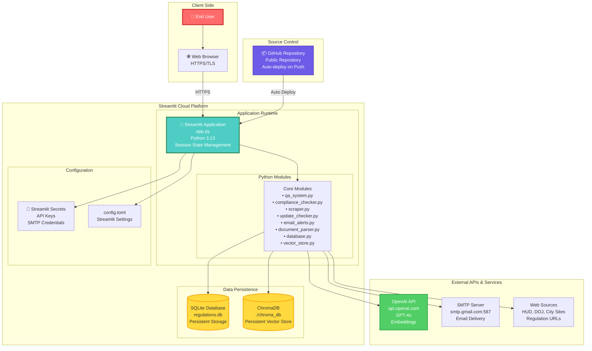
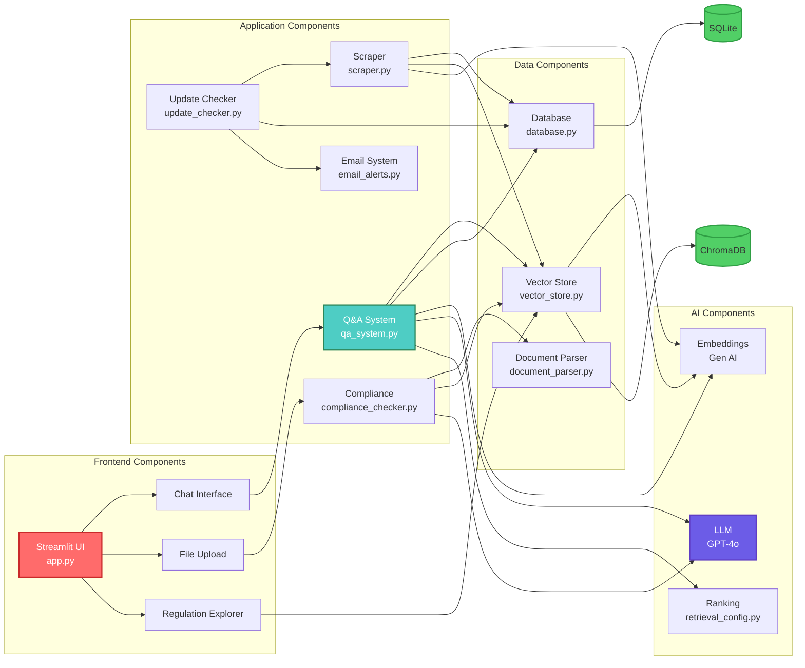
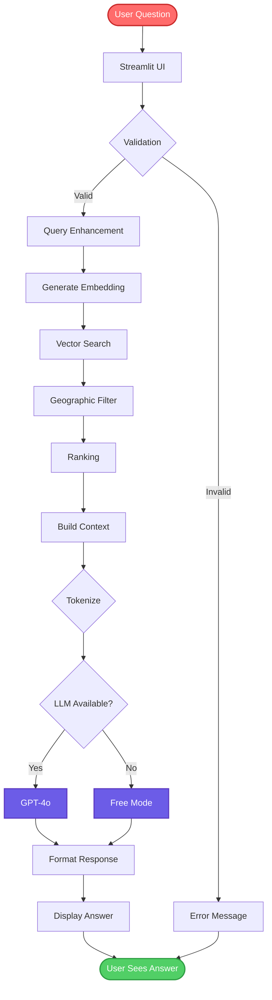
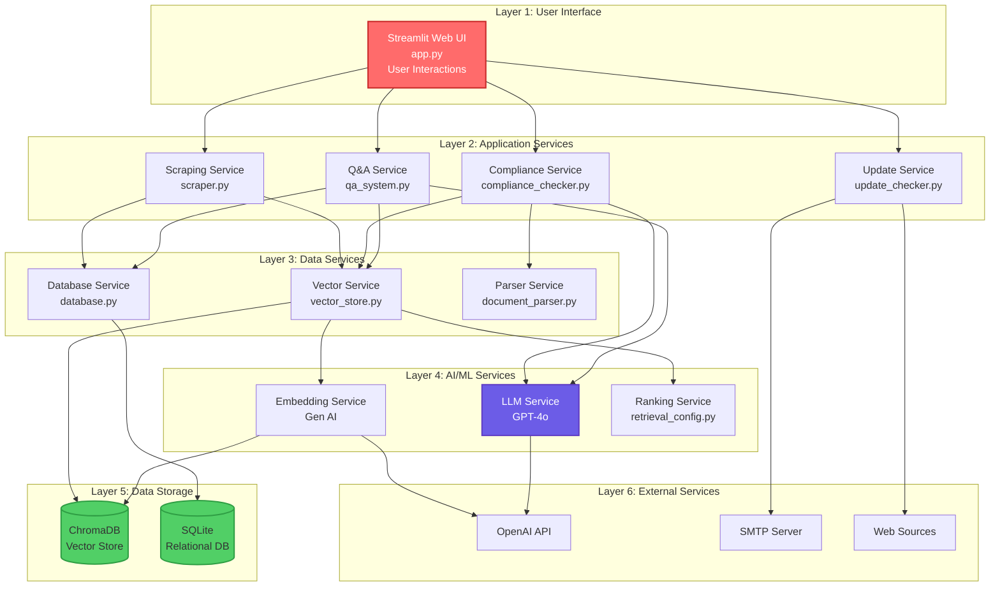
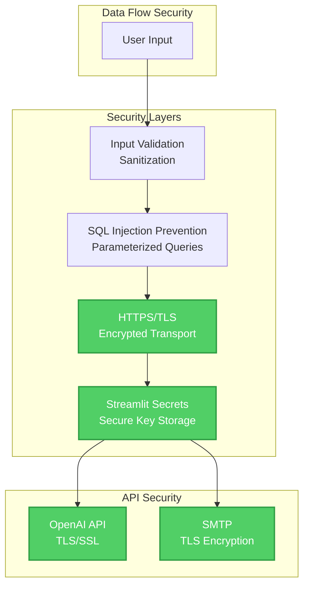
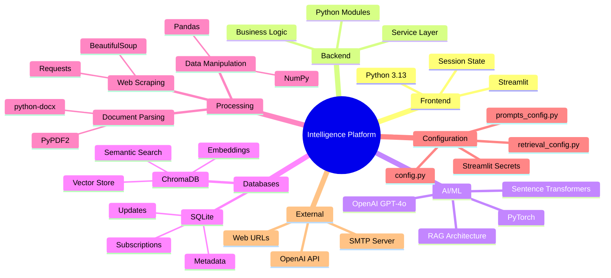
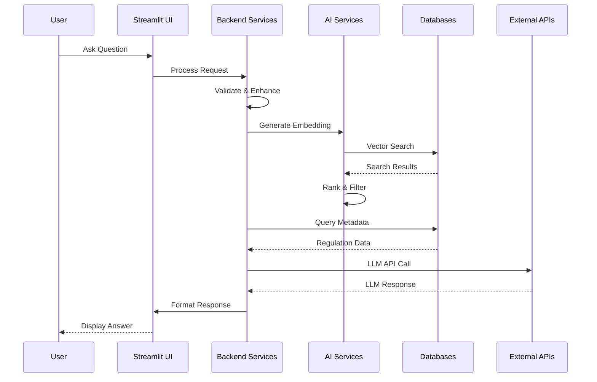
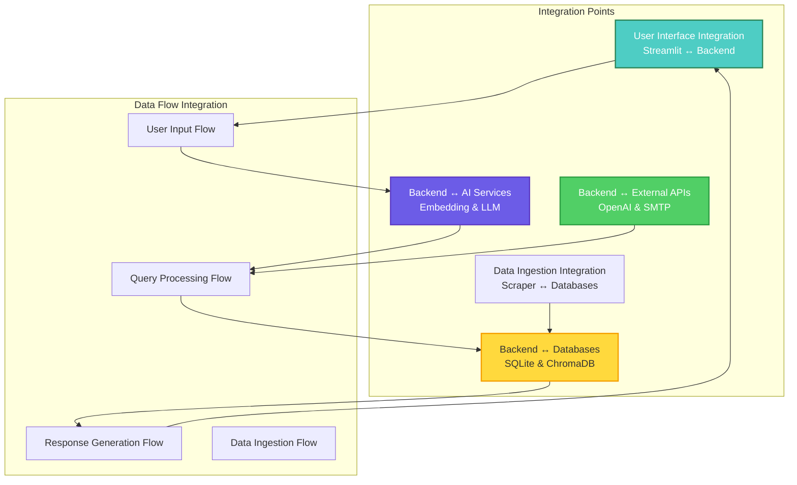

# Solution Architecture - Mermaid Diagrams

Complete solution architecture diagrams for Intelligence Platform using Mermaid syntax.

---

## 🏗️ Complete Solution Architecture

```mermaid
graph TB
    subgraph "User Layer"
        USER[👤 End Users<br/>Property Managers<br/>Leasing Professionals<br/>Legal Advisors]
        BROWSER[🌐 Web Browser<br/>Chrome, Firefox, Safari<br/>HTTPS/TLS Connection]
    end

    subgraph "Presentation Layer - Streamlit Cloud"
        STREAMLIT[📱 Streamlit Web Application<br/>app.py<br/>Python 3.13+<br/>Session State Management]
        
        subgraph "UI Components"
            IP_PAGE[💬 IP Agent Page<br/>Chat Interface<br/>Q&A System]
            EXPLORER[📚 Regulation Explorer<br/>Browse & Search]
            COMPLIANCE[✅ Compliance Checker<br/>Document Upload]
            UPDATES[📢 Update Log<br/>Change History]
            EMAIL_UI[📧 Email Alerts<br/>Subscriptions]
            SETTINGS[⚙️ Settings<br/>Data Management]
        end
    end

    subgraph "Application Layer - Business Logic"
        subgraph "Core Services"
            QA_SERVICE[QASystem<br/>qa_system.py<br/>RAG Engine<br/>Question Answering]
            COMP_SERVICE[ComplianceChecker<br/>compliance_checker.py<br/>Document Analysis<br/>Clause Review]
            SCRAPER_SERVICE[RegulationScraper<br/>scraper.py<br/>Web Scraping<br/>Content Extraction]
            UPDATE_SERVICE[UpdateChecker<br/>update_checker.py<br/>Change Detection<br/>Hash Comparison]
            EMAIL_SERVICE[EmailAlertSystem<br/>email_alerts.py<br/>Notifications<br/>Daily Summaries]
            PARSER_SERVICE[DocumentParser<br/>document_parser.py<br/>PDF/DOCX Parsing<br/>Text Extraction]
        end

        subgraph "Enhancement Services"
            RETRIEVAL[retrieval_config.py<br/>Query Enhancement<br/>Source Prioritization<br/>Geographic Filtering<br/>Result Reranking]
            PROMPTS[prompts_config.py<br/>LLM Prompts<br/>Custom Instructions<br/>Subject Enhancement]
        end
    end

    subgraph "Data Layer"
        subgraph "Relational Database"
            SQLITE[(SQLite Database<br/>database.py<br/>regulations.db<br/>• Regulation Metadata<br/>• Update History<br/>• Email Subscriptions<br/>• Compliance Checks)]
        end

        subgraph "Vector Database"
            CHROMADB[(ChromaDB Vector Store<br/>vector_store.py<br/>./chroma_db<br/>• Regulation Embeddings<br/>• Semantic Search Index<br/>• Metadata Filtering<br/>• Similarity Matching)]
        end

        subgraph "Configuration & Source Data"
            CONFIG[config.py<br/>Settings & Secrets<br/>Environment Variables]
            CSV[sources.csv<br/>Regulation URLs<br/>Source Metadata]
        end
    end

    subgraph "AI/ML Services"
        subgraph "LLM Services"
            OPENAI[OpenAI API<br/>GPT-4o Model<br/>• Q&A Generation<br/>• Compliance Analysis<br/>• Update Summarization<br/>• Clause Refinement]
        end

        subgraph "Embedding Services"
            SENTENCE_TRANS[Sentence Transformers<br/>all-MiniLM-L6-v2<br/>Free Embeddings<br/>384 Dimensions<br/>Local Processing]
            OPENAI_EMBED[OpenAI Embeddings<br/>text-embedding-3-small<br/>1536 Dimensions<br/>Optional Premium]
        end
    end

    subgraph "External Data Sources"
        WEB_SOURCES[🌐 Web Regulation Sources<br/>• HUD.gov<br/>• DOJ.gov<br/>• Texas.gov<br/>• City Government Sites<br/>• Legal Databases]
    end

    subgraph "External Services"
        SMTP_SERVER[📧 SMTP Email Server<br/>Gmail / Custom SMTP<br/>TLS Encryption<br/>Email Delivery]
    end

    subgraph "User Input"
        USER_DOCS[📄 User Documents<br/>PDF Lease Documents<br/>DOCX Lease Documents<br/>Upload via UI]
    end

    %% User to Presentation Layer
    USER --> BROWSER
    BROWSER -->|HTTPS| STREAMLIT
    STREAMLIT --> IP_PAGE
    STREAMLIT --> EXPLORER
    STREAMLIT --> COMPLIANCE
    STREAMLIT --> UPDATES
    STREAMLIT --> EMAIL_UI
    STREAMLIT --> SETTINGS

    %% Presentation to Application Layer
    IP_PAGE --> QA_SERVICE
    COMPLIANCE --> COMP_SERVICE
    EXPLORER --> CHROMADB
    EXPLORER --> SQLITE
    UPDATES --> UPDATE_SERVICE
    EMAIL_UI --> EMAIL_SERVICE
    SETTINGS --> SCRAPER_SERVICE
    SETTINGS --> CHROMADB
    SETTINGS --> SQLITE

    %% Application Layer Interactions
    QA_SERVICE --> RETRIEVAL
    QA_SERVICE --> PROMPTS
    QA_SERVICE --> CHROMADB
    QA_SERVICE --> SQLITE
    QA_SERVICE --> OPENAI
    QA_SERVICE --> SENTENCE_TRANS

    COMP_SERVICE --> PARSER_SERVICE
    COMP_SERVICE --> RETRIEVAL
    COMP_SERVICE --> PROMPTS
    COMP_SERVICE --> CHROMADB
    COMP_SERVICE --> SQLITE
    COMP_SERVICE --> OPENAI

    PARSER_SERVICE --> USER_DOCS

    SCRAPER_SERVICE --> CSV
    SCRAPER_SERVICE --> WEB_SOURCES
    SCRAPER_SERVICE --> SQLITE
    SCRAPER_SERVICE --> CHROMADB
    SCRAPER_SERVICE --> SENTENCE_TRANS

    UPDATE_SERVICE --> SCRAPER_SERVICE
    UPDATE_SERVICE --> SQLITE
    UPDATE_SERVICE --> OPENAI
    UPDATE_SERVICE --> EMAIL_SERVICE

    EMAIL_SERVICE --> SQLITE
    EMAIL_SERVICE --> SMTP_SERVER

    %% Data Layer
    CHROMADB --> SENTENCE_TRANS
    CHROMADB --> OPENAI_EMBED
    CHROMADB --> RETRIEVAL

    %% Configuration
    STREAMLIT --> CONFIG
    QA_SERVICE --> CONFIG
    COMP_SERVICE --> CONFIG
    EMAIL_SERVICE --> CONFIG

    %% Styling
    style USER fill:#ff6b6b,stroke:#c92a2a,stroke-width:3px,color:#fff
    style STREAMLIT fill:#4ecdc4,stroke:#2d8659,stroke-width:3px,color:#fff
    style QA_SERVICE fill:#6c5ce7,stroke:#5f3dc4,stroke-width:2px,color:#fff
    style COMP_SERVICE fill:#6c5ce7,stroke:#5f3dc4,stroke-width:2px,color:#fff
    style SQLITE fill:#ffd93d,stroke:#f59f00,stroke-width:2px
    style CHROMADB fill:#ffd93d,stroke:#f59f00,stroke-width:2px
    style OPENAI fill:#51cf66,stroke:#2f9e44,stroke-width:2px,color:#fff
    style SENTENCE_TRANS fill:#51cf66,stroke:#2f9e44,stroke-width:2px,color:#fff
```

---

## 🔄 Solution Architecture - Deployment View

---

## 🎯 Solution Architecture - Component View

---

## 🔄 Solution Architecture - Data Flow View

---

## 🏛️ Solution Architecture - Layered View

---

## 🔐 Solution Architecture - Security & Data Flow

---

## 📊 Solution Architecture - Technology Stack View

---

## 🔄 Solution Architecture - Request/Response Flow

---

## 🎯 Solution Architecture - System Integration View

---

**Last Updated**: November 2024  
**Platform**: Intelligence Platform  
**Based on**: Complete codebase implementation

