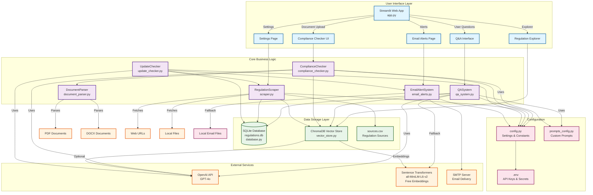
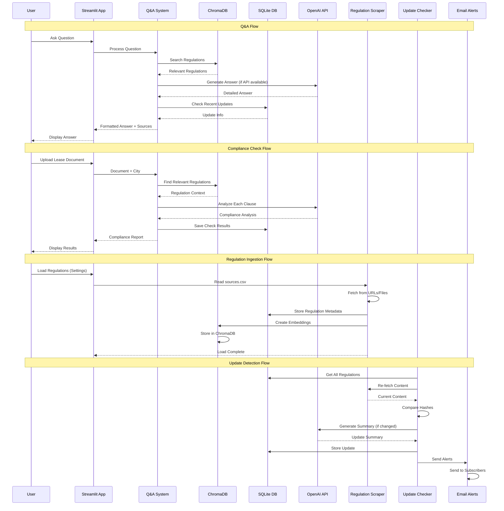
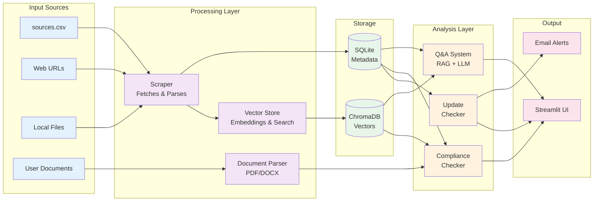
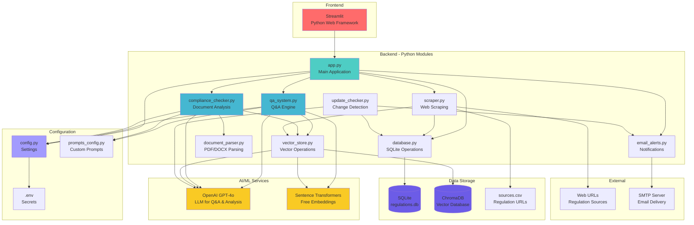
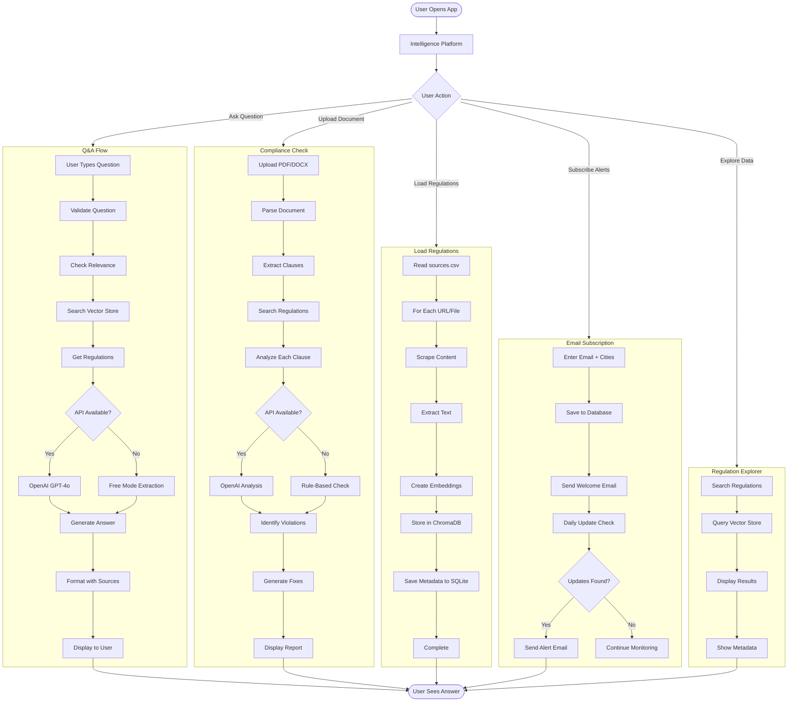
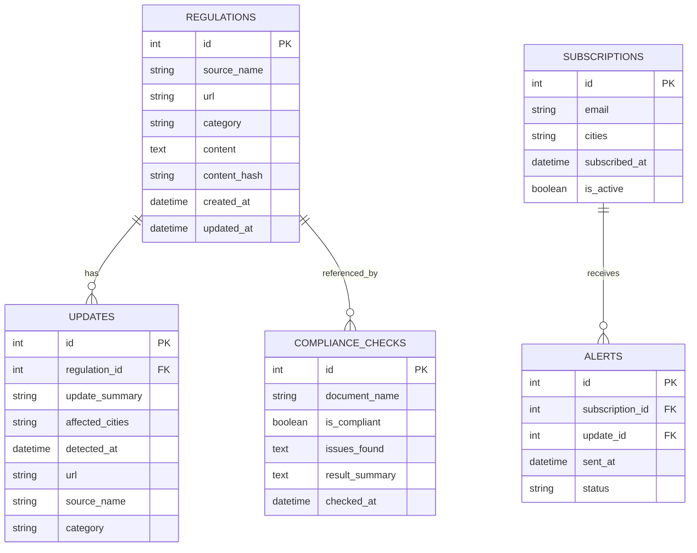

# System Architecture - Mermaid Diagrams

## Complete System Architecture

## Data Flow Diagram

## Component Interaction Diagram

## Technology Stack Diagram

## System Flow - Complete User Journey

## Database Schema

